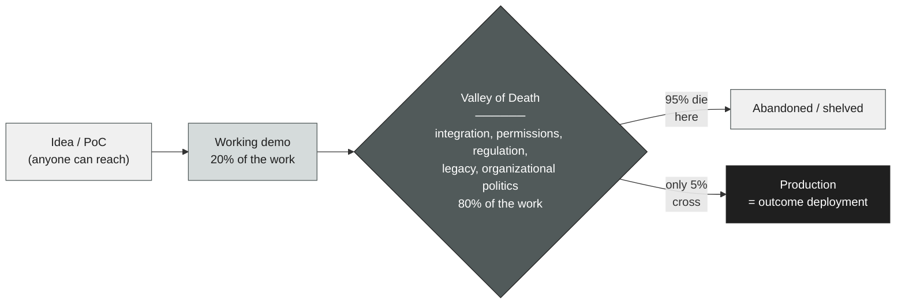
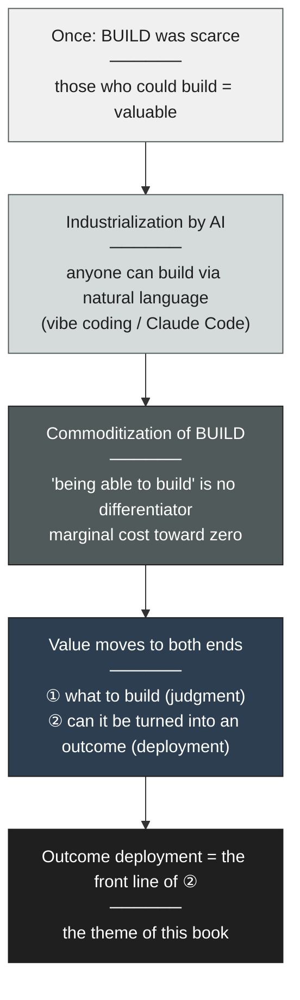
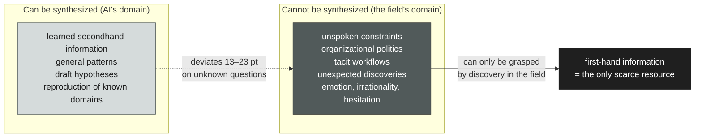
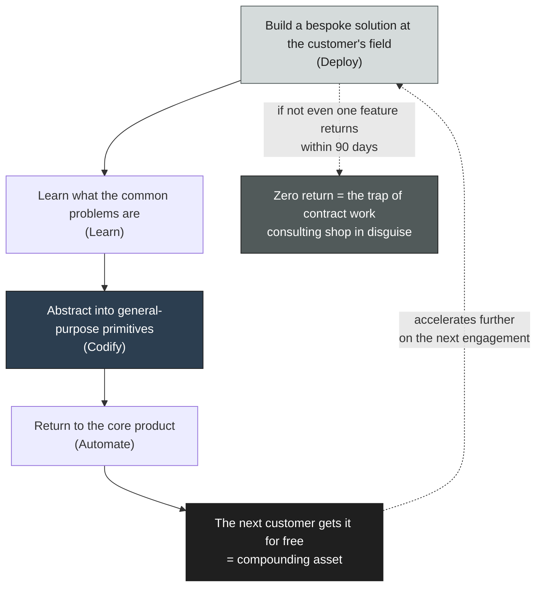
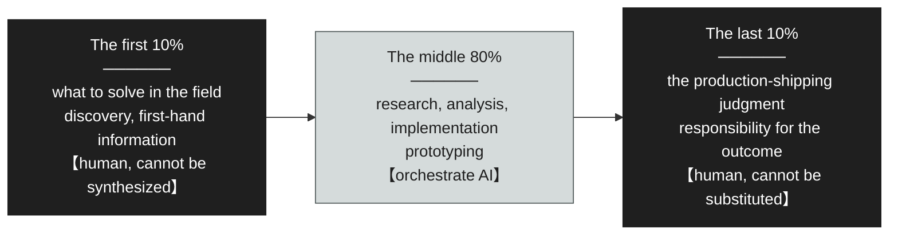
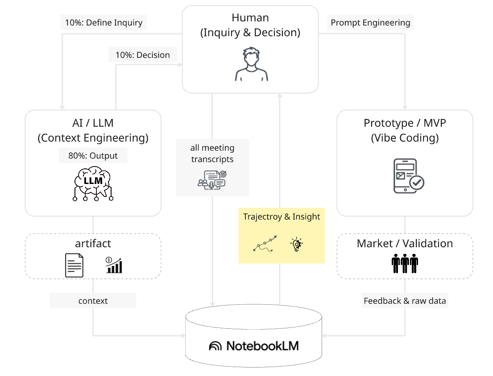
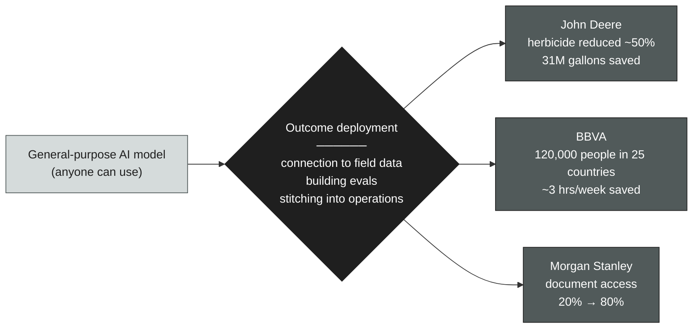
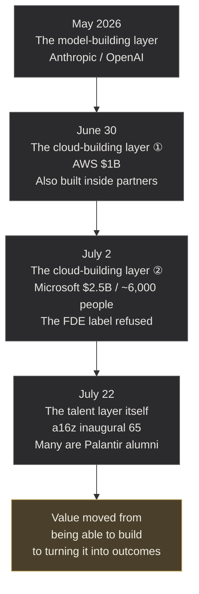

# The Forward Deployed Shift — Where Value Survives When "Building" Is Over

> **"Building is over. Deploying has just begun."**

 

---

# Prologue: The End of the Building Era

In May 2026, within the span of a single week, the two giants of the AI industry placed almost the same bet.

On May 4, Anthropic announced the founding of a new enterprise AI services company together with Blackstone, Hellman & Friedman, and Goldman Sachs. Its aim is to implement Claude into the core operations of mid-sized enterprises. Just one week later, on May 11, OpenAI launched "The Deployment Company." With an initial investment of more than four billion dollars, it brought together nineteen partners and acquired the applied-AI consultancy Tomoro, securing roughly 150 engineers from day one. Google Cloud, too, has publicly stated that its CEO is accelerating the hiring of the same kind of talent, citing demand from customers and partners.

This is no coincidence. It means that the companies that understand AI most deeply arrived at the same conclusion at the same moment. And that conclusion is this: building a smarter model is no longer enough.

What these two companies founded are not research organizations for "building" smarter models. They are organizations for taking models that have already been built and "delivering them to the customer's field and turning them into outcomes." OpenAI stated its reason for founding the company in these terms: building powerful AI models is only part of the work, and the real impact comes from helping people and organizations use them safely, effectively, and at scale.

Think about it. The company that holds the world's best model is itself admitting that "merely building a model creates no value." There is no more eloquent testimony to the spirit of the age.

Why are the world's most advanced AI companies now pouring enormous capital not into the "building" side but into the "delivering" side? This book begins with that question.

## The Hottest Job Is No Longer the One That Builds Models

The answer appears most vividly in the explosive demand for a single role: the **Forward Deployed Engineer (FDE)** — the agent of implementation who embeds in the customer's field and makes AI work in a real operational environment. Rather than working from a research lab at headquarters, they are deployed to the customer's "front line" and are accountable all the way to producing an outcome.

According to data from the job platform Indeed, as reported by Business Insider, FDE job postings grew roughly 729% year over year from April 2025 to April 2026. Here, one point of precision is in order. The widely circulated figure of "from 643 to 5,330" is **not an absolute count, but an index value with January 2025 set to 100** (Business Insider initially reported this as an absolute count and later issued a correction). A separate dataset (Live Data Technologies) reports a figure of a 1,165% year-over-year increase. The baseline period and the question of whether the numbers are indices or absolute counts differ by source, but **the direction — that demand is surging — is consistent across every piece of primary data.** The venture capital firm a16z called this the hottest job at startups.

Why insist on precision? In booms like this, numbers take on a life of their own. The absolute-count story — "643 became 5,330" — is easy to grasp and easy to spread. But it is not the fact. This book is written not to ride the boom, but to understand its **structure.** That is exactly why it insists on being accurate from the very first number.

What matters is the reason for the surge. a16z explains this not as a "hiring boom" but as a structural argument. The more the foundation models become interchangeable and ownership of the application layer becomes what matters, the more durable the companies that possess hands-on implementation support become — that is, a strategy of **trading margin for moat.** The power to fit a model to the customer's reality has become scarcer and more valuable than the model itself.

## What This Book Means by "Outcome Deployment"

This book captures this structural change in a single phrase: **"outcome deployment."**

Outcome deployment refers not to "building (BUILD)" AI, but to the power to grasp first-hand information at the customer's front line, turn a bespoke solution into a reproducible asset, and **convert it into an actual business outcome.**

Let me define the scope of the term clearly here. "Outcome deployment" in this book includes **every form of intervention that grows a customer's business discontinuously, whether the business is new or existing.** Implementing AI into an existing business and producing not a continuous improvement but a structural leap — that, too, is outcome deployment. Indeed, this latter domain is where the FDE primarily stands.

Why call it "outcome deployment" rather than the technical term "implementation"? Because the phrase is meant to carry, in a single term, the central thesis of this book: that the source of value has shifted from "building" to "turning into outcomes." It is not the "implementation" of merely writing code. It is "outcome deployment" — taking responsibility all the way to producing a result in the customer's business. The entire book is packed into the difference of this one phrase.

"Building" with AI was industrialized in 2025. The moment implementation was handed to everyone, "being able to build" ceased to be a differentiator. What remained was only the power to stitch what was built into the customer's chaotic reality and turn it into an outcome.

| | BUILD (building) | Outcome Deployment (delivering and turning into outcomes) |
|---|---|---|
| Who does it | Anyone (AI substitutes / accelerates) | Those who stand at the customer's front line |
| Scarcity | Low (commoditized) | High (depends on tacit knowledge) |
| Required information | Learned secondhand information | First-hand information obtainable only on site |
| Deliverable | A working demo / prototype | A system that runs in production and produces outcomes |
| Source of value | Model performance | Fit to the context of the field |
| Substitutability | Can be substituted by AI | Cannot be substituted by AI |

## This Book's Reader, and Its Map

This book is written for three kinds of people.

* First, **the person who has been put in charge of enterprise AI adoption but is stuck at the PoC stage, unable to reach production.** The DX / AI-promotion division, corporate planning, the information-systems department of an operating company. The wall you are facing has a structural name.

* Second, **the engineer, consultant, or business developer asking where their own value will survive in the age of AI.** Even those drawn to the job title "FDE" can hold value regardless of their title, if they understand its essence not as a job but as a structure.

* Third, **the executive or manager who has been told to "do something with AI" but does not know what to do.** This book shows, with primary data, why 95% fail — and what the remaining 5% are doing.

The map of this book is as follows. First, we look at why 95% of AI dies in the field (Chapter 1). Next, we dissect the structure by which "building," just upstream of that, was industrialized (Chapter 2). Then we show that the work of crossing the valley — outcome deployment — was already invented twenty years ago at Palantir (Chapter 3), and we argue that its core lies in discovery, a step that cannot be synthesized (Chapter 4, the heart of this book). We then proceed to the conditions under which it becomes an asset rather than degenerating into contract work (Chapter 5), the methodology of practice (Chapter 6, the heart of this book), and the empirical evidence from existing businesses (Chapter 7). Finally, we follow the record of the three months after this book was published, during which every layer of the industry came down, in turn, to the delivering side (Chapter 8).

Why this scarcity called "outcome deployment" emerges, where it resides, and how one can come to possess it — we will unravel it in order, from primary data and from the structure of the field.

### References

1. OpenAI, "OpenAI launches the OpenAI Deployment Company" (May 11, 2026)
   <https://openai.com/index/openai-launches-the-deployment-company/>
2. Anthropic, "Building a new enterprise AI services company with Blackstone, Hellman & Friedman, and Goldman Sachs" (May 4, 2026)
   <https://www.anthropic.com/news/enterprise-ai-services-company>
3. Business Insider, "Forward-deployed engineer jobs are in demand" (May 2026; includes the index-value correction)
   <https://www.businessinsider.com/forward-deployed-engineer-jobs-in-demand-2026-5>
4. Paraform / Live Data Technologies, "Forward-Deployed Engineers: How Demand Grew 10x in 18 Months" (April 2026; +1,165% YoY)
   <https://www.paraform.com/blog/forward-deployed-engineer-demand-quadrupled>
5. a16z, "Trading Margin for Moat: Why the Forward Deployed Engineer Is the Hottest Job in Startups" (June 2025)
   <https://a16z.com/services-led-growth/>

 

---

# Chapter 1: Why 95% Die in the Field

Investment in AI continues at a scale unprecedented in history. But is that investment turning into outcomes?

In July 2025, the report "The GenAI Divide: State of AI in Business 2025," released by MIT's Project NANDA, answered this question with a cruel number. **Against an estimated 30–40 billion dollars that companies have poured into generative AI, roughly 95% of organizations have failed to produce a measurable impact on their P&L.** Only a mere 5% are generating rapid revenue contribution.

This study is based on a review of more than 300 publicly disclosed AI deployments, structured interviews with 52 organizations, and responses from 153 senior leaders. (In Fortune's reporting, this is described as "150 interviews + a survey of 350 employees + analysis of 300 public cases," so there are discrepancies in the description of the study's scale, which I note here.) There is room to debate how the sample was drawn, but the direction of the conclusion does not waver.

## The Primary Cause of Failure Is Not the Model

The most important point this report raised is not the failure rate itself. It is the **cause of failure.**

The report states it plainly: this divide (the GenAI Divide) is not produced by model quality or regulation, but is determined by "approach." Failure arises from brittle workflows, the absence of contextual learning, and misalignment with day-to-day operations. MIT calls this the **"learning gap."**

This must not be misread. When the world discusses AI's failures, it immediately blames technology or the external environment — "the model isn't smart enough yet," "there are hallucinations," "regulation hasn't caught up." But the answer shown by the most comprehensive study is different. **95% of AI dies not because the model isn't smart, but because the smart model cannot be fit to the chaos that is the customer's field.**

Concretely, what is happening? The typical failures the report lists are these. The AI tool cannot learn the organization's context. It does not remember prior instructions. It repeats the same mistakes. It is not integrated into existing workflows and stands isolated as a standalone tool. Users, accustomed to the comfort of the ChatGPT they use personally, find the AI their company introduced inflexible and end up not using it. None of these are problems of the model's intelligence. They are **problems of fit to the field.**

## Why Does In-House Building Fail?

This report contains one more primary record that directly supports this book's thesis. **A strategic partnership (an alliance with an external vendor) is twice as likely to succeed as in-house building.** Purchasing from or partnering with a specialized vendor succeeds about 67% of the time, whereas trying to build it yourself in-house succeeds at only a third of that rate.

This may run counter to intuition. "We know our own operations best. So in-house building should be advantageous" — many companies think this way and try to build AI themselves. According to the report's authors, almost everywhere they surveyed, companies were trying to build their own tools. But the data showed the opposite.

Why? Because knowing your own operations and being able to translate them into a system that runs on AI are entirely different capabilities. The in-house team knows its own operations well, but lacks the specialized skill of outcome deployment — "fitting AI to the field." The external implementation partner, on the other hand, is a specialist who has repeated the same "fitting" across many fields. **"Doing it yourself" actually raises the probability of failure** — this fact becomes the starting point of the paradox that runs through this entire book.

## 95% Is Not a Single Number

The figure "95%" is shocking, but it should not be made the sole basis of an argument. An argument that depends on one number from one study is brittle. The same phenomenon — "deployment is broken" — is corroborated from different angles by multiple independent studies. Their samples and definitions all differ, but the direction is consistent.

| Study | Metric | Figure |
|---|---|---|
| MIT NANDA (2025) | No measurable P&L effect | ~95% (only 5% with rapid revenue contribution) |
| Gartner (2024 forecast) | GenAI projects abandoned after PoC | At least 30% by the end of 2025 |
| BCG (2025) | Companies generating value from AI (future-built) | 5% (60% obtain almost no value) |
| IDC / Lenovo (2025, APJ) | Production deployment relative to PoCs | Avg. 23 PoCs → 3 reach production / PoCs deemed successful are under 10% of the total |

The range of the numbers swings by study. 30%, 95%, 5% — at first glance they even seem contradictory. But what each is measuring is different (abandonment rate, P&L effect, share of value-creating companies, production-deployment rate). If the object of measurement differs, of course the numbers differ. What matters is that **from whatever angle one looks, the conclusion converges on the same point: the bottleneck — "PoCs are overflowing, yet they don't turn into value in production" — lies not on the technology side but on the deployment side.**

The reason this book does not lean on a single "95%" but instead juxtaposes multiple studies is that this very convergence is what is trustworthy. The numbers swing. But the structure does not.

## The Valley of Death Lies Between "Building" and "Delivering"

Conventionally, the hard part of AI adoption was thought to be "whether you can build the model." But what the data shows is the opposite. That a demo works is no longer the hard part. The hard part lies beyond it.

This "valley of death" is the theme of this book. Getting a demo running in a sandbox is only 20% of the work. The remaining 80% is connecting to the enterprise's authentication infrastructure (SSO/SAML), integrating legacy ETL pipelines, the regulatory constraints of data residency and audit, and the organizational politics of going to the customer's security team to obtain production permissions.

Imagine it. You built a demo of an AI agent and showed it to the customer's executive. The executive is impressed. "Wonderful. Make this usable across the whole company starting next week." But the real work starts here. The customer's authentication infrastructure is a ten-year-old system, and no API documentation exists. The data you need is managed across three separate departments, and one of them "for security reasons" is something no one will touch. To obtain production credentials, you need approval from the information-systems department, but they say, "We don't connect tools of unknown origin to the internal network." The brilliance of the demo fades fast in the face of this reality.

No matter how much you polish the prompt, you cannot cross this valley. What is needed to cross the valley is not a smarter model. It is the power to stand at the customer's field, grasp the structure of its chaos through first-hand information, and stitch a bespoke solution into production — **outcome deployment.**

Concretely, what is "the 80% of the work"? Enumerating the obstacles that stand between a working demo and production reveals their mass.

- **Authentication and authorization:**
  Connecting to the customer's SSO/SAML infrastructure. Designing who can access which data.
- **Data integration:**
  Data scattered across multiple departments, undocumented legacy APIs, and reconciling data whose formats don't match.
- **Regulation and compliance:**
  Data-residency constraints, audit-log requirements, and building in human-in-the-loop verification.
- **Obtaining production permissions:**
  Negotiating with the information-systems department and the security team. This is not technology — it is organizational politics.
- **Adoption in the field:**
  Whether the field actually uses it. How to embed it into existing operational flows. If it isn't used, no matter how well it runs, the outcome is zero.

All of these are unrelated to the model's intelligence. And all of these are unique to each customer. There is no universal correct answer. The only way is to stand at the field and grasp that customer's unique terrain. This is "the body of outcome deployment," which Chapter 4 discusses in detail.

The place where 95% die is not the research lab where AI is built. It is the customer's front line, where AI is delivered.

In the next chapter, we dissect the structure of industrialization — why "building (BUILD)" became this cheap, and why value moved to the far side of the valley.

### References

1. MIT Project NANDA, "The GenAI Divide: State of AI in Business 2025" (July 2025; the report itself)
   <https://mlq.ai/media/quarterly_decks/v0.1_State_of_AI_in_Business_2025_Report.pdf>
2. Fortune, "MIT report: 95% of generative AI pilots at companies are failing" (with an interview of author Challapally himself)
   <https://fortune.com/2025/08/18/mit-report-95-percent-generative-ai-pilots-at-companies-failing-cfo/>
3. Gartner, "Gartner Predicts 30% of Generative AI Projects Will Be Abandoned After Proof of Concept By End of 2025" (July 2024)
   <https://www.gartner.com/en/newsroom/press-releases/2024-07-29-gartner-predicts-30-percent-of-generative-ai-projects-will-be-abandoned-after-proof-of-concept-by-end-of-2025>
4. BCG, "Are You Generating Value from AI? The Widening Gap" (2025)
   <https://www.bcg.com/publications/2025/are-you-generating-value-from-ai-the-widening-gap>
5. Bain & Company, "Executive Survey: AI Moves from Pilots to Production"
   <https://www.bain.com/insights/executive-survey-ai-moves-from-pilots-to-production/>

 

---

# Chapter 2: The Industrialization of BUILD — Why "Being Able to Build" Stopped Being Value

Just upstream of the valley of death — on the "building" side — what happened?

The answer can be stated in one line. **"Building (BUILD)" with AI was industrialized.** The prototype that a specialized engineer once spent weeks on can now be generated in hours from natural-language instructions. The ability to write code has changed from a scarce resource held by a few specialists into a public good that anyone can use.

## The Boundary Between "the Person Who Thinks" and "the Person Who Builds" Disappeared

The essence of this change is that **the separation between "the person who thinks" and "the person who builds" disappeared.**

Conventionally, the process of a new business or AI adoption went like this. There was a person who thought about the business, who documented the requirements and handed them to an engineer. The engineer implemented it, and weeks later a prototype came back. But what was produced was off from the image the thinker had. They requested revisions, and several more weeks were lost. This translation loss and time loss between "the person who thinks" and "the person who builds" dragged down every project.

Vibe coding — the technique of instructing AI in natural language to write code — erased this separation. The person who thinks can directly become the person who builds. This technique, named by OpenAI co-founder Andrej Karpathy, and the suite of tools including Anthropic's Claude Code, drove the cost of generating a prototype dramatically downward. An idea you come up with in the morning, you turn into something working, and by the afternoon you show it to the customer. Such a cycle became reality.

I discussed this structure in a separate piece, "The Two Blind Spots in an Era Where Anyone Can Build with AI." The gist is this. As a result of AI filling in "building (BUILD)," value moved to the blind spots at both ends — **(1) what to build (the first judgment), and (2) is it true (the final verification).** The "building" in the middle is no longer a blind spot. AI filled it in. This book reexamines this "turning it into an outcome" side at the front line of enterprise AI adoption.

## Weeks Became Hours

Let us capture the magnitude of this change on a concrete time axis.

Conventionally, from the moment a new-business owner came up with an idea to the moment they had a working prototype they could show a customer, what was required? First, document the requirements (a few days). Get internal approval to secure engineering resources (a few days to a few weeks). The engineer implements it (a few weeks). Review what's produced and fix the gaps (a few more weeks). In total, one to two months at the very least. Meanwhile the market moves, competitors get ahead, and the first hypothesis grows stale. By the time it's done, you're told, "That? Another service is already out there."

Vibe coding compressed these one to two months into a few hours. The owner, themselves, within the same day, builds a working prototype. They give an idea shape in the morning and run it in front of the customer in the afternoon. If the reaction is poor, they fix it on the spot or throw it out and rebuild. "To find the right answer, build a lot and throw a lot away" — agile as it was originally meant to be has finally become real.

What I want to emphasize here is not the speed itself. It is that **becoming fast moved the location of the bottleneck.** In the era when building took a month, the bottleneck was clearly "building." But the moment building became a few hours, the bottleneck moved to "what should be built (the first judgment)" and "how to deliver what was built into production (outcome deployment)." When the rate-limiting step changes, the location of value changes too.

## The Cost of "Building" Approached Zero

The venture capital firm a16z restates this change in an investor's words. The more the foundation models become interchangeable and everyone can build on the same base, the more "being able to build" itself ceases to be a competitive advantage. Differentiation moves to the hands-on-support side that **deploys what was built into the customer's reality and turns it into an outcome.** a16z called this a strategy of trading margin for moat.

What happens when the cost of software falls? It is the basics of economics. **The price of a commoditized thing falls toward its marginal cost.** Now that the marginal cost of building has approached zero, "being able to build" alone can no longer command a price. A price can only be commanded for something scarce. And what is scarce now is the power to turn what was built into an outcome amid chaotic reality.

Here is the starting point of this book. It is precisely because "being able to build" became commoditized that "being able to turn what was built into an outcome" became the only scarcity.

## Industrialization Exposed "the Real Hard Part"

Now that BUILD became cheap, an ironic fact came to light. **The real hard part of a project was never "building" from the start.**

Until now, because "building" was hard, its difficulty masked all the other hard parts. In the era when merely building a prototype took weeks, you ran out of strength before you could even think about "how to deliver what you built into production." But the moment building shrank to a few hours, the cover came off. What emerged from underneath was the "80% hard part" — integration, permissions, regulation, legacy, organizational politics — that had been there all along yet had been invisible.

To put it as an analogy: until now the trailhead up the steep mountain (BUILD) was so precipitous that no one looked at the path beyond it (DEPLOY). AI built a staircase at the trailhead. Everyone became able to get past the trailhead. Only then did it become visible to all that beyond it lay the real hard part — a sheer-walled valley.

The death of the 95% we saw in Chapter 1 happens here. By exactly the degree that building became easy, the valley after building became, relatively, deeper and more clearly visible.

In the next chapter, we will see that this work of crossing the valley — outcome deployment — has in fact existed for twenty years, and that one company had established it as a structure.

### References

1. Satoshi Yamauchi, "The Two Blind Spots in an Era Where Anyone Can Build with AI" (note)
   <https://note.com/satoshi_yamauchi/n/nca6060af22dd>
2. a16z, "Trading Margin for Moat: Why the Forward Deployed Engineer Is the Hottest Job in Startups"
   <https://a16z.com/services-led-growth/>
3. Depth & Velocity — A New Business Development Methodology for the Generative AI Era (Leading AI)
   <https://github.com/Leading-AI-IO/depth-and-velocity>

 

---

# Chapter 3: What Outcome Deployment Is — A Structure Palantir Invented Twenty Years Ago

The structure of "outcome deployment" that OpenAI and Anthropic jumped on simultaneously in 2026 is in fact not new. Twenty years ago, one company had invented it. **Palantir.**

## Why Ordinary SaaS Did Not Work

Palantir's first customers were intelligence agencies such as the CIA and the Department of Defense. These organizations lacked, one after another, the conditions that ordinary software companies take for granted.

First, **they cannot state requirements explicitly.** The customer themselves cannot articulate what the problem is. Or, even if they can articulate it, classification prevents them from conveying it externally. Second, **they cannot share data.** For security reasons, data cannot leave their premises, so engineers have no choice but to go inside the customer's environment. Third, **the workflow is in constant flux.** Requirements set once become invalid the following week.

For customers like these, the ordinary SaaS model of selling packaged software from the outside does not work at all. Since requirements never solidify, you cannot even write a specification. Since data cannot leave, you cannot develop externally either.

What Palantir created there was a model of **stationing engineers at the customer's field for months at a time.** Rather than selling from outside, go inside. Rather than waiting for a specification, discover the requirements at the field. This is the prototype of the structure later called Forward Deployed Engineering.

## Echo and Delta — Two Roles That Live in the Field

In its official blog, Palantir organizes this role into two. **"Delta,"** who writes code and builds production systems, and **"Echo,"** who understands the domain, discovers problems, and manages relationships.

Delta writes code that runs in production, inside the customer's environment. Whereas the ordinary developer builds "one feature for many customers," Delta builds "many features for one customer." This asymmetry matters. The developer of a general-purpose product builds the greatest-common-denominator feature set. Delta optimizes thoroughly to the unique reality of the one customer in front of them.

Echo does not write code. Instead, Echo understands the customer's operations, designs workflows, iterates rapidly with users, and manages relationships with the key people at the field. Echo's typical work is understanding the customer's operations, designing workflows that fill the gaps of existing systems, and managing senior stakeholders.

Bob McGrew, a former Palantir executive who also served as OpenAI's CRO, expressed this essence as **"Productized Consulting."** To embed in the customer as deeply as consulting does, while making the result reusable as a product — making these two seemingly contradictory things coexist is the core of outcome deployment.

## Turning a Gravel Road into a Paved Highway

But here lies a trap. If you keep building "many features for one customer," it becomes a mountain of bespoke contract work, and compounding does not kick in. With ten customers, ten bespoke builds remain, forming an unmaintainable mountain of technical debt. This is nothing but high-end contract development.

What made Palantir great is that it designed a **feedback loop that sublimates these bespoke solutions into core-product primitives.** Palantir expresses this as turning "a gravel road into a paved highway." From among the bespoke solutions built grittily for the first customer (the gravel road), it finds the parts that can be generalized and generalizes them into features of the core product (the paved highway). The next customer can travel that paved highway for free.

It is precisely because this mechanism exists that Palantir's outcome deployment became a business rather than contract work. Each engagement grows the product, and the grown product makes the next engagement easier. This compounding is one of the forces that pushed Palantir up into a company with a market capitalization of over 100 billion dollars.

Outcome deployment is this whole structure. **Enter the customer's environment, grasp tacit knowledge as first-hand information, build a bespoke solution, and return it as a reproducible asset.** The FDE is merely the new name the AI industry of 2026 gave to this structure.

| Role | Responsibility | Metaphor | Meaning in outcome deployment |
|---|---|---|---|
| Delta | Implementing production code | Many features for one customer | Build what runs in the field |
| Echo | Domain understanding / relationship management | Finding the gravel road | Grasp first-hand information and tacit knowledge |
| Product return | Generalizing the bespoke solution | Sublimation into a paved highway | Turn contract work into a compounding asset |

## Why Was It Rediscovered Now?

Why was this structure, which Palantir solved twenty years ago, rediscovered in 2026?

The answer is as we saw in Chapters 1 and 2. "Building" with AI was industrialized, and value moved to the "turning into an outcome" side. And 95% of enterprise AI is dying in the valley of death. To cross this valley, the structure Palantir devised against intelligence agencies — "enter the field, discover the requirements, return the bespoke solution to the product" — becomes necessary just as it is.

What is interesting is that the three difficulties Palantir's customers once faced — cannot state requirements explicitly, cannot share data, workflow in constant flux — are now being reproduced in the AI adoption of every company. A company trying to introduce AI agents cannot precisely articulate what should be automated (cannot state requirements explicitly). It cannot expose confidential data or personal information to model training (cannot share data). And because AI's capabilities evolve every few months, the optimal way to use it constantly changes (workflow in constant flux). The special difficulty that only intelligence agencies faced twenty years ago has now become the standard difficulty of every company introducing AI. That is exactly why Palantir's solution — outcome deployment — is being rediscovered across the entire industry.

In 2026, a16z called the spread of this phenomenon across the entire industry "The Palantirization of Everything." OpenAI's Deployment Company and Anthropic's joint venture are re-implementations, in the AI era, of the structure Palantir solved twenty years ago. The only difference is that, whereas the customers back then were intelligence agencies, now every company in every industry has become that customer.

One further note: this chapter's claim that Palantir built the prototype is neither a metaphor nor a retrospective reading of history. In July 2026, it would be corroborated by first-hand evidence — a roster of named people (Chapter 8).

### References

1. Palantir, "Dev versus Delta: Demystifying engineering roles at Palantir" (official blog)
   <https://blog.palantir.com/dev-versus-delta-demystifying-engineering-roles-at-palantir-ad44c2a6e87>
2. Palantir, "A Day in the Life of a Palantir Deployment Strategist" (official blog; Echo)
   <https://blog.palantir.com/a-day-in-the-life-of-a-palantir-deployment-strategist-951cb59a5a96>
3. a16z, "The Palantirization of Everything"
   <https://a16z.com/the-palantirization-of-everything/>
4. The Palantir Impact — Palantir's Ontology Strategy (Leading AI)
   <https://github.com/Leading-AI-IO/palantir-ontology-strategy>

 

---

# Chapter 4: Discovery Cannot Be Synthesized — First-Hand Information, the Only Scarce Resource

The heart of this book is in this chapter.

In the preceding chapters, we saw that value moved from "building" to "turning into an outcome" (Chapter 2), and that Palantir had structured this work (Chapter 3). So, of the entire process of outcome deployment, **where is the one point that AI can least substitute?**

It is **discovery — the step, at the customer's field, of unearthing the real, unspoken problem.**

In this chapter, I make this claim. **Discovery cannot be synthesized.** That is exactly why it is the one and greatest scarce resource in outcome deployment, and the last fortress that humans can continue to hold in the age of AI.

## The Customer Does Not Know the Real Problem

The starting point of outcome deployment is to understand the customer's problem. But here lies the first, and greatest, trap. **The customer does not know their own real problem.**

This does not mean the customer is incompetent. Humans cannot articulate most of what they do day to day. Just as a master craftsman cannot explain why they chose that one move. Just as a veteran salesperson cannot accurately recount why it resonated with that customer. The knowledge of the field exists, for the most part, as **tacit knowledge** — embodied knowledge that does not become words.

The academic research on requirements engineering has long dealt with this problem. Tacit knowledge is personal and context-dependent, and even the parties themselves cannot accurately express it in language or numbers. Knowledge that cannot be written in a document cannot be extracted from documents. So the answer that comes back when you ask the customer "what is your problem" is only the tip of the iceberg — the surface that can be put into words. The real problem lies in the tacit knowledge below the surface.

## The Best Blockers Are Not Spoken

When you study FDEs' workflows, they spend up to 40% of their time on discovery. This is not a warm-up. The depth of week-1 discovery determines the value of all subsequent steps.

Why do they spend so much time on discovery? From the field of practice comes testimony like this. Enterprise customers do not hand you a clean architecture diagram. What they hand you is reality — outdated systems, tribal knowledge scattered by department, undocumented APIs, data dispersed across multiple tools. And, most importantly, **the best blockers are discovered, not spoken.**

This one line cuts to the essence of discovery. The real obstacles that stop a project — for example, "for political reasons, department A will absolutely not hand over this data," "there is a key person in this approval process who never appears on the surface," "the field ignores the official procedure and runs on its own rules" — these are never spoken in a requirements-definition meeting. Because they are not spoken, they appear on no form, no document, no kickoff deck. Only by sticking to the field are they discovered for the first time.

In a separate piece, "Don't Let AI Run Your User Interviews (The Zeroth Interview)," I argued structurally why this step cannot be synthesized. There is a growing movement to have AI conduct customer interviews on one's behalf, but in principle it cannot reach the tacit knowledge of the field. Without the "zeroth-order" observation of standing at the field before the interview, you cannot even know what you should ask.

## Why Synthetic Users Are Not a Substitute

"Then let AI create synthetic users and have them substitute for interviews" — this temptation is especially strong in recent years. Attempts to generate virtual customers with LLMs and substitute them for market research and UX research are spreading rapidly. The cost is near zero, they run 24 hours a day, and you can generate thousands of them. At first glance, it looks like a perfect solution.

But academic research clearly shows its limits.

The first limit is **structural.** An LLM can only generate text that statistically fits its training distribution. In other words, an LLM can only return "likely answers." But what creates value in a new business or AI adoption is not the "likely answer." It is the discovery no one anticipated — the outlier outside the center of the normal distribution, not at the center. **Synthetic users are structurally incapable of producing a truly unexpected discovery.** Because they regress to the mean of the training data.

The second limit is **the trap of memorization.** In one practical validation, synthetic research appeared to reproduce existing survey results with high correlation. At first glance, this looks like evidence that synthetic users are effective. But its true nature was the playback of "memorization" — the original report had been published for years and was included in the LLM's training data. In other words, it was merely solving a test whose answer it already knew. Decisively, **for new questions absent from the training data, synthetic users deviated from real human responses by as much as 13 to 23 points.** They play back the correct answer in known domains and deviate widely in unknown ones. This is the worst possible property for discovery, which seeks new findings.

The third limit is **the absence of emotion and irrationality.** People in the field act in ways that are not logical. They put up irrational resistance, harbor unexplainable unease, and show "hesitations" they do not put into words. But these very irrationalities, emotions, and nuances become the seeds of the next outcome deployment. Because synthetic users regress to a statistical median, they cannot reproduce these subtleties of human beings.

Let me avoid a misunderstanding here. I am not saying synthetic users are worthless. They can be used for drafting hypotheses, testing interview designs, and supplementing known domains. The problem is **making them a substitute for the first-hand information that underpins production-level judgment.** Synthetic methods are an auxiliary line, not a substitute for the field.

## Three Layers Visible Only in the Field

Let me make concrete what discovery grasps, dividing it into three layers. From surface to depth, AI reaches less and less.

**Layer 1: the spoken problem (the surface).**
"Creating reports takes time." "There are too many inquiries to handle." The problems the customer voices in a meeting. AI can pick these up too. They are average problems anyone can access. But solving only these puts you in the 95% of Chapter 1. Because the problems of this layer are usually not the real bottleneck.

**Layer 2: the observed reality (the middle layer).**
Visible only when you stand at the field. The official procedure manual says "execute B after A," but the field actually skips A and substitutes C. Because the system that executes A is too slow, and the field devised its own workaround. This "divergence between the official and the real" is documented by no one. Only those who observed the field can grasp it.

**Layer 3: the unspoken constraints (the deep layer).**
The deepest and most decisive layer. "This data is absolutely never shared, because of a long-standing conflict between department A and department B." "This approval requires the tacit consent of a key person who does not appear on the org chart." "The field, while outwardly following headquarters' new policy, actually ignores it." These are politics, emotion, and history. Even if you ask about them directly in an interview, they will never come out. Only by sticking to the field for a long time, earning trust, and inferring from fragments, are they finally discovered.

The success or failure of outcome deployment is determined by how much of Layer 3 you can grasp. And Layer 3, by definition, exists in no document and on no internet. There is no way it could be in AI's training data.

## The True Nature of the Learning Gap

In Chapter 1, we saw that MIT NANDA called the primary cause of failure the "learning gap." The argument of this chapter reveals its true nature.

The learning gap is often thought to be AI's inability to "learn" the context of the field. But to put it more precisely: **the context of the field is, in the first place, written down by no one. So it does not exist in the training data.** AI cannot learn from data that does not exist.

In other words, the learning gap is not a problem of technology. It is a problem of where the information resides. The tacit knowledge of the field exists in neither documents nor the internet. It exists only in the heads and bodies of the people at the field. The only one who can draw it out is the human who stands at the field, observes, dialogues, and can discover "what is not spoken."

This is the deepest source of outcome deployment's scarcity. No matter how smart AI becomes, no matter how exhaustively it learns all the world's secondhand information, the momentary hesitation of that staff member you saw at the field yesterday does not exist in AI's training data. It is first-hand information that only you possess.

## Discovery Is Not a Technique but an Attitude

Finally, let me state the practical core. Discovery is not a special technique. It is an **attitude.**

The attitude of not taking the customer's words at face value. The attitude of, instead of asking "what is the problem," standing at the field and observing "what is actually happening." The attitude of trusting the chaotic reality of the field over the orderly explanation of the conference room. The attitude of paying attention to what was not spoken over what was spoken.

As we will see in detail in Chapter 6, what systematizes this attitude as a methodology is Depth & Velocity's "hypothesis-verification cycle of first-hand information × LLM." Grasp first-hand information at the field, throw it to AI to refine the hypothesis, and verify again at the field. Go back and forth between the map (AI) and the terrain (the field). The starting point of this cycle is always discovery at the field.

In the next chapter, we discuss the dividing point of whether the bespoke solution grasped this way ends as a mountain of contract work or becomes a compounding asset.

### References

1. Satoshi Yamauchi, "Don't Let AI Run Your User Interviews (The Zeroth Interview)" (note)
   <https://note.com/satoshi_yamauchi>
2. Park et al., "'Simulacrum of Stories': Examining Large Language Models as Qualitative Research Participants" (arXiv 2409.19430)
   <https://arxiv.org/abs/2409.19430>
3. Nielsen Norman Group, "Synthetic Users: If, When, and How to Use AI-Generated Research"
   <https://www.nngroup.com/articles/synthetic-users/>
4. The Voice of User, "The largest review of synthetic participants ever conducted"
   <https://www.thevoiceofuser.com/the-largest-review-of-synthetic-participants-ever-conducted-found-exactly-what-youd-expect-synthetic-users-dont-work/>
5. FDE Tech Stack 2026 (practical account of discovery's weight)
   <https://getperspective.ai/blog/fde-tech-stack-2026-tools-forward-deployed-engineers-actually-ship>

 

---

# Chapter 5: What Separates Contract Work from Asset-ization — Productization, the Dividing Point

Outcome deployment has a fatal failure mode. Degenerating into a **"consulting shop in disguise" — contract development that merely flies a SaaS banner.**

In Chapter 3, we saw that Palantir turned bespoke solutions into compounding assets through the feedback loop of "turning a gravel road into a paved highway." But if you fail to design this loop, outcome deployment easily falls into mere contract work. This chapter discusses that dividing point.

## If Every Engagement Is Bespoke, It Is Not a Product

a16z warns: if every deal requires unique custom work, it is not a product but a consulting company with a logo on it. It further points out that if you separate the FDE unit from the product and make it an independent services division, the feedback loop to the product is lost, and it drifts into a pure services business.

This fall proceeds quietly. At first, to satisfy the customer in front of you, you do a little bespoke building. It succeeds. For the next customer, you build a little more. Before you know it, a separate codebase has proliferated for each customer, and none of them can be maintained. Revenue comes in, but no profit. Engineers are buried in maintaining existing customers, and the product does not grow. **This is the fate of a labor-intensive business wearing the skin of software.**

For example, suppose there is an inquiry where the engagement does not stand on its own as your business, and only customer-specific custom work remains. In the short term it becomes revenue. But it is contract work where compounding does not kick in, and it does not grow the product. I would pass on it. "I do not accept interventions that do not stand on their own as my business and do not return to the product" — this criterion of judgment has exactly the same structure as the logic of productization discussed in this chapter.

## A Measurable Line That Separates Contract Work from Asset-ization

So where is the line that separates contract work from asset-ization? It can be spoken not by feel, but with measurable metrics.

Before that, let me point out the most common failure of organizational design. It is **placing the outcome-deployment unit under the sales organization (GTM).** Sales incentives are about "closing the big deal in front of you." Place the people who carry outcome deployment under that, and they will keep doing endless customer-by-customer custom builds in order to win contracts. A mountain of unmaintainable technical debt, diverging from the product roadmap, piles up. Advanced playbooks teach that the outcome-deployment unit should be placed not under sales but under product and engineering. Because the purpose of outcome deployment is not "closing contracts" but "returning the field's learning to the product." Get the placement wrong, and before you even look at the metrics, you structurally lean toward contract work.

The first metric is the **productization rate.** Advanced playbooks for running FDEs define this as "at least one feature flowing back to the core product from a single engagement within 90 days," and position it as the most important leading indicator of whether the function is healthy. At the end of each engagement, ask: "Did at least one feature, which the next customer can use for free, emerge from this engagement?" If the answer is yes, you have laid one stretch of paved highway. If no, it was left a gravel road — that is, contract work.

The second metric is the **ratio of bespoke custom work.** The investment fund F-Prime offers a threshold. As a rule of thumb, if more than 30–40% of deployments require significant bespoke work, the problem is no longer sales (GTM) but product design. If bespoke work exceeding 30% has become the norm, it is a sign that "the product is immature, so you have to build custom every time," and the organization is leaning toward contract work.

Only when this flywheel — Deploy (deployment to the field) → Learn (learning) → Codify (abstraction) → Automate (productization) — turns does outcome deployment convert from contract work into a business. What matters is the perspective of treating gritty custom work at the field not as "customer support" but as "the front line of R&D." The field is the source of first-hand information for growing the product.

## Even Incumbent Consultancies Came Down to the Implementation Side

The importance of this division is proven, more eloquently than anything, by the movements of the traditional consultancies.

In 2026, EY formally established Forward Deployed Engineer roles in the UK and Ireland. It is an early case of a major consultancy officially adopting this model. Deloitte, too, launched "Forward Deployed Engineering" as a formal service, naming stalled pilots, low adoption rates, and a shortage of AI talent as the problems to solve. Accenture partnered with Microsoft to stand up a dedicated FDE organization, claiming it would shorten the move from concept to production from months to days.

This shows a tectonic shift in the industry. **The group of companies that were the very emblem of the advisory model — delivering slides — are coming down to the implementation side, writing production code themselves.** Meanwhile, AI companies like OpenAI and Anthropic are coming down from the side that sells models to the side that carries out implementation. Consultancies from above, AI companies from below, are colliding head-on at the single point of "outcome deployment."

What this collision means is one thing. "Outcomes are born neither from recommendations (slides) nor from general-purpose APIs (products), but only from outcome deployment that runs in the customer's environment and returns to a compounding asset" — the entire market is converging on this conclusion.

### References

1. Perspective AI, "The Forward Deployed Engineer Playbook (2026)" (productization rate)
   <https://getperspective.ai/blog/the-forward-deployed-engineer-playbook-how-to-structure-run-and-scale-an-fde-function-in-2026>
2. F-Prime Capital, "The Uncomfortable Truth About FDEs" (the 30–40% threshold)
   <https://fprimecapital.com/blog/the-uncomfortable-truth-about-fdes/>
3. EY, "EY launches Forward Deployed Engineer AI roles" (April 2026)
   <https://www.ey.com/en_uk/newsroom/2026/04/ey-launches-fde-roles>
4. Deloitte, "Announcing Forward Deployed Engineering"
   <https://www.deloitte.com/us/en/services/consulting/articles/announcing-forward-deployed-engineering.html>
5. The Structural Shift from SaaS to Service-as-a-Software (Leading AI)
   <https://github.com/Leading-AI-IO/saas-is-dead-the-next-ai-business-model>

 

---

# Chapter 6: The Methodology of Outcome Deployment — Applying D&V to the Field

Up to here, we have argued "why outcome deployment is scarce." This chapter treats, as the other core, "how one can come to possess it."

Let me state the conclusion first. The methodology of outcome deployment does not need to be invented anew. **Depth & Velocity (D&V)**, which I systematized as a new-business development methodology for the generative-AI era, becomes the operating system of outcome deployment just as it is. Because D&V is, at the same time, both "the OS of new business" and "the OS for producing outcomes at the front line."

Why does the same OS work for both? As we saw in Chapter 1, "outcome deployment" in this book refers to discontinuous-growth intervention regardless of whether the business is new or existing. The 0→1 of a new business and the AI implementation into an existing business — the steps that work are the same: grasp first-hand information at the field, judge what to build, build fast with AI, and take responsibility for the outcome in production. D&V is the thinking OS that runs through this process.

## Mapping D&V's Four Elements to the Outcome-Deployment Field

The core elements of D&V correspond almost one-to-one to each step of outcome deployment. First, the overall picture.

| D&V element | Role in outcome deployment | Corresponding step |
|---|---|---|
| Hypothesis-verification cycle of first-hand information × LLM | Grasp the field's first-hand information and refine hypotheses with AI | discovery (Ch. 4) |
| The 10:80:10 principle | In the first 10%, decide what to solve; in the last 10%, judge production | the two ends of judgment |
| Project Brain | Accumulate the field's tacit knowledge and history as an asset | product return (Ch. 5) |
| Prototype Driven | Verify the customer's reality with something that works | breaking through the valley of death (Ch. 1) |

Below, I detail each in the context of the outcome-deployment field.

## ① The First-Hand Information × LLM Cycle — Going Back and Forth Between the Map and the Terrain

The starting point of outcome deployment is the discovery discussed in Chapter 4. D&V turns this into a methodology as the "hypothesis-verification cycle of first-hand information × LLM."

The LLM has learned the world's open secondhand information. This is an immense amount of knowledge, but it has a decisive limit. **What the LLM holds is the "map."** **But the first-hand information you saw, heard, and grasped at the field — the "terrain" — does not exist inside the LLM.** The map is available to anyone. It is no differentiation. Only you, who stood at the field, know the terrain.

The cycle turns like this. First, form a hypothesis at the field ("this customer's this operation must have this problem"). Second, go out to the field and verify — interview, observe, have them touch the prototype. Third, acquire first-hand information (what the customer said, how they reacted, what they hesitated over). Fourth, feed that first-hand information to the LLM and ask, "from these results, is there an insight I'm overlooking?" Fifth, critically verify the LLM's suggestions, update the hypothesis, and go out to the field again.

What makes this cycle fundamentally different from conventional methods is that **the LLM intervenes between verification and the next hypothesis.** When humans interpret alone, confirmation bias and the bias of experience creep in. The LLM produces new suggestions from patterns the human overlooked and from knowledge outside their specialty. When you combine the map and the terrain, the most precise route — the path of outcome deployment — becomes visible.

However, as argued in Chapter 4, the starting point of this cycle must always be the field's first-hand information. If you start from the LLM (the map), you only get the average solution anyone can obtain. Only by starting from the field (the terrain) is value that cannot be synthesized born.

Let me add one practical point. When turning the cycle, **you must not summarize the first-hand information before handing it to the LLM.** Feed the interview transcript in full text, as is. Keep the fillers like "um" and "uh," the stumbling, the digressions of the talk. Because it is precisely in the moment the customer stumbled that the clue to Layer 3 — the unspoken constraints discussed in Chapter 4 — lies hidden. Summarizing strips this clue away first of all. The moment you have AI summarize, the most valuable first-hand information is lost. You must not lower the resolution of the terrain yourself.

## ② 10:80:10 — Humans Hold the Two Ends of Judgment

In outcome deployment, how do you design the division of roles between humans and AI? D&V formulates this as "the 10:80:10 principle."

**The first 10% is the human's will and question.**
At the customer's field, decide "what is the real problem" and "what should be solved." This is discovery itself, as discussed in Chapter 4, and it cannot be synthesized. The moment you entrust this to AI, you get only the average problem-setting anyone can obtain.

**The middle 80% is handed to AI.**
Research, analysis, coding, prototyping, verification. The process that humans once spent weeks on, AI compresses into hours. Here the human does not move their hands. They orchestrate AI. Rather than writing code themselves, they have AI write it, correct the direction along the way, and add context.

**The last 10% is, again, the human.**
The judgment of whether or not to ship what was built to production. Bearing the ethical and business responsibility. AI says, "the accuracy of this system is an estimated 92%." But it is the human who decides "do we bet on 92% and ship to production" and bears responsibility for the result. AI cannot take responsibility.

As we saw in Chapter 4, the first 10% (discovery) cannot be synthesized. And the last 10% (the production judgment), because it entails responsibility, cannot be substituted by AI. **An outcome deployer is the human who holds these two 10% ends and orchestrates AI in the middle 80%.** The moment you let go of the two ends, the human becomes a terminal of AI and loses their value.

## ③ Project Brain — Making Tacit Knowledge an Organizational Asset

In Chapter 5, we argued that productization, which turns bespoke solutions into compounding assets, separates contract work from a business. But returning to the product code alone loses another important asset. **The first-hand information gained at the field, and the very history (context) that led to the judgment.**

At the outcome-deployment field, an immense amount of first-hand information is born — interview records, the unease noticed at the field, the rejected options and the reasons for rejecting them, the history of pivots. These do not remain in summarized minutes. But it is precisely here that the seeds of the next outcome deployment sleep.

D&V turns this into an asset as "Project Brain." Meeting transcripts, intermediate deliverables, full-text user interviews — accumulate the unprocessed raw data just as it is. What is decisively important here is **not relying on easy AI summarization.** Summarization is an act of compressing information. What is lost in the process of compression is not numbers or facts, but nuance, intensity, context — that is, the very seeds of outcome deployment's next move. The hesitation a staff member swallowed, the one remark a customer let slip, an idea laughed off. These are stripped away by summarization, but they are a treasure trove of tacit knowledge.

Having this Project Brain makes three things possible. First, fact-based sparring — you can verify hypotheses against all past first-hand information. Second, accelerated onboarding — new members can inherit past history together with the first-hand information. Third, uncovering business opportunities — you can instantly trace "a similar idea came up before; why did we stop?"

Concretely, what do you accumulate? Three kinds of raw data. First, the full text of all meeting and discussion transcripts. Not summarized versions, but full text with dates and context. Second, all intermediate deliverables — whiteboard photos, competitive analyses, rejected design proposals. In particular, the record of the branches: "why proposal B and not proposal A," "why proposal C disappeared." This "option that vanished" becomes a gold mine in a later pivot. Third, the full text of user interviews. This lets you draw out insights from angles humans cannot notice.

Outcome deployment becomes an organizational asset only when both wheels turn — the product code and this Project Brain (the accumulation of tacit knowledge). The product code accumulates "what can be built," and Project Brain accumulates the first-hand information and the history of judgment for "why it should be built." With only the former, it becomes a context-less jumble of features. With only the latter, nothing that works remains. Only with both wheels does outcome deployment become a compounding asset that accelerates the next engagement.

## ④ Prototype Driven — Breaking Through the Entrance of the Valley of Death with Something That Works

In Chapter 1, I said that just before the valley of death lies "a working demo (20% of the work)." Who can build this demo, and how fast, determines the initial velocity of outcome deployment.

D&V's "Prototype Driven" uses the vibe coding seen in Chapter 2 as a weapon, so that the person who thinks directly builds a working prototype. What matters is not the degree of completion. To verify the customer's reality, 70% completion is enough. Rather, an over-polished demo turns the customer into a "judge" and induces nitpicking of non-essentials. With a 70% demo, if you ask "is there anything that feels off about the flow here," the customer becomes a "co-creator," and their opinion becomes the next first-hand information.

Something that works exposes the customer's reality faster than slides. The customer who said "this demo is wonderful," the moment they try to connect it to their own environment, the valley of death seen in Chapter 1 — integration, permissions, legacy, politics — all appear at once. The prototype is the fastest probe for discovering the existence of this valley early.

## The Four Elements Are Integrated into a Single Cycle

These four elements are not separate techniques. They are integrated into a single cycle.

Discover at the field (the starting point of ①), decide what to solve in the first 10% (②), build a prototype fast and verify reality (④), throw the first-hand information you gained to the LLM and refine the hypothesis (①), accumulate the entire history in Project Brain (③), and make the production judgment in the last 10% (②). And then return the bespoke solution you gained there to the product (Chapter 5). Keeping this cycle turning at high speed is the entirety of the methodology of outcome deployment.

The overall picture of D&V and the details of each element are published as an independent open-source manifesto. This chapter is the "outcome-deployment application" of it. Readers who want to know the parent body of the methodology in depth should refer to the D&V manifesto.

## Practical Steps to Run Outcome Deployment in the Field

Finally, let me bring the methodology so far down to practical steps you can run in the field starting tomorrow. I present one cycle of outcome deployment in seven steps.

**Step 1: Before you stand at the field, form one hypothesis.**
"This customer's this operation must have this problem." If you go to the field without a hypothesis, you won't know what to look at. But hold this hypothesis on the premise of discarding it.

**Step 2: At the field, dig down to Layer 3.**
Don't be satisfied with the spoken problem (Layer 1); grasp the observed reality (Layer 2) and the unspoken constraints (Layer 3). Leave the conference room and watch the actual work. Ask "why do you do it that way" five times.

**Step 3: Record the first-hand information without summarizing.**
The transcript in full text. Keep the unease, the hesitation, the digressions. This becomes the material for Project Brain.

**Step 4: Throw the first-hand information to AI and refine the hypothesis.**
Ask, "from this record, what insight am I overlooking?" "What material would refute my hypothesis?" Verify AI's suggestions critically.

**Step 5: Build a 70% prototype within the same day.**
Build something that works with vibe coding and have them touch it at the field. Don't aim for perfection. Use it as a probe to discover the existence of the valley of death early.

**Step 6: Turn the obstacles to production into a map of the valley.**
Record, one by one, the obstacles of integration, permissions, regulation, and politics that appear the moment you try to connect the prototype to production. This becomes the work plan for the body of outcome deployment — the 80% of the work.

**Step 7: Find the one feature, from the bespoke solution, that returns to the product.**
At the end of the engagement, ask: "Did one feature, which the next customer can use for free, emerge?" If it did, you laid one stretch of paved highway. By repeating this, labor turns into a compounding asset.

These seven steps are merely the four elements discussed in this chapter — the first-hand information × LLM cycle, 10:80:10, Project Brain, Prototype Driven — rearranged along the time axis. Turn them in order, and anyone can practice the cycle of outcome deployment. What matters is to keep turning it. The right answer does not come out in one turn. The more you turn it, the higher the resolution of the terrain, and the higher the precision of crossing the valley.

### References

1. Depth & Velocity — A New Business Development Methodology for the Generative AI Era (Leading AI; full manifesto)
   <https://github.com/Leading-AI-IO/depth-and-velocity>
2. The 10:80:10 Principle — The Golden Ratio of Human–AI Co-Creation (Leading AI)
   <https://github.com/Leading-AI-IO/the-10-80-10-principle>
3. The Orchestrator in the AI era — The Profile of the Human Who Orchestrates AI (Leading AI)
   <https://github.com/Leading-AI-IO/the-orchestrator-in-the-ai-era>

 

---

# Chapter 7: The Discontinuous Growth of Existing Businesses — Outcomes Come Not from the Model but from the Last Mile

As defined in Chapter 1, this book refers to every form of intervention that grows a customer's business discontinuously, whether new or existing. And the greatest battlefield lies, rather, in **the discontinuous growth of existing businesses.**

Why? A new business has, in the first place, a small base. But if you implement AI into an existing business — an enormous business that is already running — and produce a structural leap, the impact is of a different order of magnitude. This chapter proves it with three primary cases. Each shows that the outcome was born not from "a smart model" but from "implementation into the field."

## John Deere — What Halved Pesticide Use Was Not a Smart Model

John Deere, an agricultural-machinery maker nearly 200 years old, implemented its AI-equipped precision-spraying system "See & Spray" into its existing farm-machinery business.

According to the official release, in the 2025 season, customers reduced their use of non-residual herbicide by an average of nearly 50% and saved roughly 31 million gallons of herbicide mix. The covered area was over 5 million acres — larger than the state of New Jersey. And this was in a season with poor conditions — high weed pressure and heavy rainfall.

What matters here is the source of this outcome. What created the value was not "a smarter general-purpose model." Think about it. A camera mounted on a tractor running at 15 miles per hour scans the ground, distinguishes in real time whether something is a weed or a crop, and instantly controls individual nozzles. On farmland where the network is unstable, sub-50-millisecond inference at the edge is required. To produce this accuracy, more than 77 kinds of weeds, crops, and backgrounds were trained on field images.

In other words, what produced the outcome was **implementation fit thoroughly to the physical constraints of the field.** Take a general-purpose cloud AI to farmland, and without a network it won't run. The appearance of weeds differs by region. This "last mile" — implementation matched to the uniqueness of the field — is exactly what produced the discontinuous outcome of a nearly 50% reduction. A smart model is a necessary condition, but not a sufficient one. The sufficient condition was outcome deployment.

## BBVA — Stitching It into Existing Banking Operations at Company-Wide Scale

According to OpenAI's official case study, the global bank BBVA deployed ChatGPT Enterprise to 120,000 employees across 25 countries. It is one of the largest enterprise deployments even in the financial industry.

What is noteworthy is how it was deployed. It was not handed to the whole company at once. It started in the early phase with 3,300 accounts, and after establishing outcomes and usage there, expanded roughly tenfold. In the early phase, 80% of users used it daily and saved roughly three hours a week on routine work.

Here too, the driver of the outcome is not the model alone. A dedicated OpenAI team designed internal agents that integrate with BBVA's existing systems, built the strict security and privacy controls the bank requires, and constructed company-wide training and a systematic deployment model. In other words, only because there was the work of "stitching" AI into the context of the existing business that is banking — outcome deployment — did adoption at the scale of 120,000 people become real. Had they merely handed out the model, it would have died in the 95% valley of death.

## Morgan Stanley — Connection to First-Hand Information Produces the Outcome

The third case, Morgan Stanley, supports this book's thesis most directly.

The firm implemented, into its wealth-management operations, an AI assistant that searches across 100,000 internal documents. According to OpenAI's official case study, as a result, advisors' access to documents jumped from 20% to 80%. The firm's lead stated that they moved from a state of being able to answer 7,000 questions to a state of being able to answer any question from a corpus of 100,000 documents.

Why does this support this book's thesis? What produced the outcome was not the smartness of a general-purpose model. **It was the connection to a corpus of 100,000 internal documents — that is, a corpus of first-hand information — and the construction of the evals that guarantee its accuracy.** Morgan Stanley's internal documents, naturally, do not exist on the internet. They are not in the LLM's training data either. They are exactly the "first-hand information that cannot be synthesized" discussed in Chapter 4. Connecting AI to this, and building the evals up to a level where advisors at the field can trust and use it — this outcome deployment quadrupled document access.

## What the Three Cases Show — the Same Conclusion

Agricultural machinery, a global bank, wealth management. The industries, the problems, and the tech stacks are entirely different. But the conclusion the three cases show is completely one.

Let me organize the common pattern of outcome deployment that can be extracted from the three cases.

- **Fit to the physical and institutional constraints of the field:** John Deere fit to farmland's network constraints and edge inference, BBVA to the bank's security requirements, Morgan Stanley to the governance of internal documents. Bring a general-purpose model in as is, and none of them would have worked.
- **Connection to first-hand information:** In all three cases, the source of value was "data not on the internet." Field images, internal systems, an internal corpus. The first-hand information that cannot be synthesized, discussed in Chapter 4, is exactly what produced the outcome.
- **Phased adoption design:** BBVA expanded in stages, 3,300 → 120,000. Rather than handing it to the whole company at once, it scaled after establishing outcomes and usage at the field. This is the same structure as the productization of Chapter 5 — generalize after establishing the bespoke solution.
- **Building the evals:** Morgan Stanley not only connected to the internal corpus but built the evals up to a level the field can trust and use. Between "it works" and "the field trusts and uses it" lies a large valley.

**A discontinuous outcome is born not from the smartness of the model, but from the outcome deployment that stitches it into the front line of existing operations.** Even using the same general-purpose model, only the 5% that could be fit to the field produce outcomes, and the 95% that merely handed it out die in the valley of death. What makes the difference is not the model. It is outcome deployment.

This is the structure the book described as of May 2026.

In the next chapter, we follow what happened in the three months that came after. Whether that structure was correct was answered not by my argument, but by the movement of the industry itself.
### References

1. John Deere, "Deere Customers Use See & Spray Technology Across 5 Million Acres in 2025" (official)
   <https://www.deere.com/en/news/all-news/see-spray-technology-across-5-million-acres/>
2. OpenAI, "BBVA and OpenAI collaborate to transform global banking" (official)
   <https://openai.com/index/bbva-collaboration-expansion/>
3. OpenAI, "Morgan Stanley uses AI evals to shape the future of financial services" (official)
   <https://openai.com/index/morgan-stanley/>

---

# Chapter 8: Everyone Who Builds Came Down — June–July 2026, When the Layers Filled Vertically

This book opened in May 2026. 
That single week when Anthropic and OpenAI each stood up an organization on the "delivering" side.

But that was only the beginning. 
In the three months since this book described that structure, events moved further. 
And the way they moved has, unintentionally, tested the book's own thesis. 
This chapter is the record of those three months.

## June 30 — AWS Reached Inside Its Partners

On June 30, 2026, Amazon Web Services moved.

It announced **$1 billion** for a dedicated Forward Deployed Engineering organization. 
Thousands of FDEs, deployed as small pods of five or six embedded inside customer companies. 
It is led by Francessca Vasquez, VP of Frontier AI. 
AWS stated explicitly that the organization would do more than build and maintain requested systems.

Judged by the dollar figure alone, this looks like a large cloud vendor reinforcing its services arm. 
But the second initiative AWS announced the same day matters far more.

**Partner-Led Forward Deployed Engineering.** 
A plan to build AWS-credentialed FDE teams **inside** consulting partner firms. 
AWS framed it as neither a certification nor a training program, 
but as a durable, embedded delivery capability placed inside the consulting firms customers already rely on — 
the same methodology, the same production bar, operating at the same velocity.

Why go that far? 
AWS gave the reason itself: **demand for production-grade agentic systems had outpaced the delivery capacity of any single organization.**

The 95% from Chapter 1, restated from the supply side, is a statement that the total capacity to deliver is insufficient. 
AWS's decision means it concluded that its own hiring could not close that gap. 
Outcome deployment has become a scarce capability **contested across the entire industry**.

## July 2 — Microsoft Refused the Name

Forty-eight hours after AWS, Microsoft moved.

It launched **Microsoft Frontier Company**: **$2.5 billion**, roughly **6,000** industry and engineering experts. 
More than double the AWS commitment, announced two days later.

But the most important thing about the announcement is neither the money nor the headcount.

Judson Althoff, Microsoft's Commercial Business CEO, 
**explicitly declined to attach the Forward Deployed Engineer label** to the venture, 
saying it goes beyond what has been called forward-deployed engineering.

Here is the decisive point for this book.

**Microsoft refused the name. But what it did was the same.** 
Send people inside the customer. Stay accountable until outcomes appear. 
Structurally identical to Anthropic, to OpenAI, to AWS.

If this were merely a fashionable job title, 
a company of Microsoft's stature would not need to avoid the name while copying the substance. 
Declining to participate would always remain an option.

Yet in practice, it had to follow the same structure even while rejecting the label. 
That fact is the strongest available proof of what Chapters 2 and 3 argued.

**This is not a job-title trend. It is a structure you cannot refuse.**

With a trend, you can choose whether to join. 
With a structure, you can only comply. 
The name could be refused; the structure could not. That was Microsoft's July 2.

## July 22 — The Palantir Alumni Appeared as a Roster

Then, on July 22, 2026, a16z moved.

It announced the **65 fellows** selected for the inaugural cohort of its eight-week Forward Deployed Engineer Fellowship. 
Thousands of applications arrived from around the world. 
Those selected lead FDE at companies including OpenAI, Mistral, Cognition, HappyRobot, Poetic, and Decagon.

And a16z wrote this in the announcement:

> **Many are Palantir alumni.**

The names given include Barry McCardel of Hex, Kevin Bai at Anthropic, 
Isa Gomez of OpenAI, Senta Knuth of ElevenLabs, and Vinoo Ganesh of Kepler. 
All left Palantir, and all now sit on the side that is defining the FDE playbook.

What this means is unambiguous.

The structure "Palantir invented twenty years ago," argued in Chapter 3, 
was not a metaphor, nor a retrospective reading of history. 
**It was corroborated by first-hand evidence, as a roster of named people.**

The structure was not independently reinvented. 
The people who know it in their bodies simply moved. 
Delta, Echo, and the paving of gravel roads described in Chapter 3 
were transplanted into the core of the AI industry not through papers or commentary, but **through people**.

And what a16z did is an attempt to **manufacture** that talent. 
When demand outruns supply, a market first competes to hire. 
When hiring proves insufficient, it turns to cultivation. 
Opening a fellowship signals that outcome deployment has entered the phase of being made, not merely recruited.

## The Layers Filled Vertically

Placed in sequence, the three months look like this.

The companies that build models came down first. 
Then the companies that build clouds came down. 
And finally, the work of manufacturing the practitioners began.

**In three months, the layers filled vertically.** 
Capital, organizations, and talent are all migrating from the building side to the delivering side.

In the prologue I wrote that the simultaneous moves by Anthropic and OpenAI were no coincidence. 
Three months on, it turns out they were not merely non-coincidental: 
they were the first two moves in a process by which every layer of the industry arrives, in turn, at the same conclusion.

## What This Means for Those Working in Japan

Of these three months, which single move matters most for the field in Japan?

I believe it is AWS's Partner-Led FDE.

What that initiative signals is that the capability of outcome deployment 
is not something to be enclosed within a handful of Silicon Valley firms, 
but something that **should be built inside consulting firms and development companies**.

Enter the customer's site, understand the operation, carry a working system into production. 
There is no shortage of companies in Japan that already do this daily. 
System integrators, contract development firms, in-house IT departments — all of them already stand in the field. 
They already possess the scarcest resource outcome deployment requires: proximity to the customer's reality.

The question is not whether the capability exists. 
It is whether that work ends as "build what was asked and deliver it," 
or whether each bespoke solution is converted into an asset that compounds into the next engagement. 
Whether the productization line argued in Chapter 5 is drawn, or not — that alone.

**Standing in the same field, this single fork turns contract work into either disposable labor or compounding capital.** 
When Palantir turned gravel roads into paved highways, it was standing at exactly this fork. 
And as of July 2026, Palantir is no longer the only one standing there.

### References

1. CNBC, "AWS puts $1 billion into new AI unit to embed engineers with customers, joining growing wave" (June 30, 2026)
   <https://www.cnbc.com/2026/06/30/aws-amazon-ai-forward-deployed-engineers.html>
2. AWS Partner Network Blog, "Introducing Forward Deployed Engineering for Partners: Winning the Future of Enterprise AI" (official, June 30, 2026)
   <https://aws.amazon.com/blogs/apn/introducing-forward-deployed-engineering-for-partners-winning-the-future-of-enterprise-ai/>
3. TechCrunch, "Microsoft launches its own AI deployment company with $2.5 billion commitment" (July 2, 2026)
   <https://techcrunch.com/2026/07/02/microsoft-launches-its-own-ai-deployment-company-with-2-5-billion-commitment/>
4. a16z, "Meet the a16z Forward Deployed Engineer Fellows" (official, July 22, 2026)
   <https://www.a16z.news/p/meet-the-a16z-forward-deployed-engineer>
5. a16z, "Introducing the a16z FDE Fellowship" (official, May 28, 2026)
   <https://www.a16z.news/p/introducing-the-a16z-fde-fellowship>

 

---

# Epilogue: You Become an Outcome Deployer

Let me gather the argument of this book into a single line.

"Building (BUILD)" with AI was industrialized (Chapter 2). As a result, 95% of AI fails to reach production and dies in the field (Chapter 1). The work of crossing the valley of death — outcome deployment — was invented twenty years ago by Palantir (Chapter 3). Its core lies in discovery, grasping the field's first-hand information that cannot be synthesized (Chapter 4), and productization, returning the bespoke solution to a compounding asset, separates contract work from a business (Chapter 5). Its methodology has already been systematized as D&V (Chapter 6). And the outcome is born, whether new or existing, from the field implementation of the last mile (Chapter 7). And in the three months after this book was published, that structure was tested as every layer of the industry came down, in turn, to the delivering side (Chapter 8).

Value has moved, completely, from "building" to "turning into an outcome."

## The Blind Spot in Structural Theory That Is Open in the Japanese-Language Sphere

The term FDE is now spreading rapidly in the Japanese-language sphere too. Job explainers, salary bands, interview prep, introductions to the tech stack — there is already a great deal of content that treats the FDE as "a new, high-paying engineering job."

But content that discusses the FDE not as a job but as **the structure of "where value survives in a world where building with AI is over"** is still surprisingly scarce. The FDE is not a new job. It is the manifestation of a structural phenomenon: as a result of AI commoditizing BUILD, value converged on the single point of "outcome deployment." A job explainer only traces the surface of the phenomenon. What this book has discussed is the structure below the surface.

This blind spot in structural theory is exactly what this book sought to fill. And this blind spot is not limited to the Japanese-language sphere. Even globally, content that systematizes the FDE with primary data (MIT NANDA, a16z, the academic limits of synthetic users, the metrics of productization) and assembles it as pure structural theory is still thin.

## The Three Conditions of an Outcome Deployer

Finally, let me present, narrowed to three, the conditions for you to become an outcome deployer. Whether or not your title is FDE is irrelevant. Whether engineer, consultant, business developer, or executive, the one who satisfies these three conditions is an outcome deployer.

**First, stand at the field.**
First-hand information can only be grasped at the field (Chapter 4). Only the one who knows the terrain (the field), not the map (AI), can cross the valley. Trust not the orderly explanation of the conference room, but the chaotic reality of the field. Pay attention to what was not spoken over what was spoken. This is the source of value that cannot be synthesized.

**Second, hold the two ends of judgment.**
What to solve (the first 10%), and shipping to production and taking responsibility for the outcome (the last 10%). The middle 80% may be handed to AI (Chapter 6). But the moment you let go of the two ends, you become a terminal of AI. The moment you ask AI "what should be solved," you obtain only the average solution. The moment you try to make AI bear final responsibility, a project is born in which no one takes responsibility. The two ends are something only a human can keep holding.

**Third, turn the bespoke solution into an asset.**
Don't end it as one-off contract work; sublimate it into primitives you can use next time (Chapter 5). Turn the gravel road into a paved highway. Accumulate the first-hand information and history gained at the field as Project Brain. This turns labor into compounding, and pushes your outcome deployment up from "contract work" to "a business."

## Three Anticipated Counterarguments

Several counterarguments to this book's claims can be anticipated. Let me answer three, in good faith.

**Counterargument 1: "Once AI evolves, won't discovery become synthesizable too?"**
As argued in Chapter 4, this is not a problem of technological evolution. The field's tacit knowledge — unspoken constraints, organizational politics, emotion, history — is, in the first place, written down nowhere. No matter how smart AI becomes, it cannot learn from data that does not exist. The problem is not the model's performance but where the information resides. So it will not be filled by the model's evolution.

**Counterargument 2: "Isn't outcome deployment too dependent on individuals to scale?"**
This is half right and half wrong. Certainly, the field's discovery is individual-dependent. But the productization of Chapter 5 and the Project Brain of Chapter 6 convert this individual dependence into an organizational asset. If you return the first-hand information an individual grasped at the field to the product and Project Brain, the next person doesn't have to start from zero. To scale an individual-dependent endeavor with compounding — that is the crux of the methodology of outcome deployment.

**Counterargument 3: "Isn't this, after all, the same as the old client-site-resident SE or consultant?"**
The surface way of working resembles it. But there are two decisive differences. First, the outcome deployer writes production code themselves — they don't deliver slides or recommendations and leave. Second, they have a compounding structure that returns the bespoke solution to the product — they don't end it as one-off contract work. These two points separate outcome deployment from "selling labor piecemeal" into "a business where compounding works." As seen in Chapter 5, whether or not you can cross this line decides everything.

## Beyond the Building Era

Once, "being able to build" was power. The person who could write code, the person who could give a prototype shape, held value. But that era is over. AI handed the power to build to everyone.

In an era when "building" is something anyone can do, value moved to the one who can turn it into an outcome at the front line. To the one who stands at the customer's field, grasps the unspoken problem, orchestrates AI to build something that works, takes responsibility for the outcome in production, and turns that learning into the next asset.

That is where value lies in the age of AI, which the phenomenon called the FDE is pointing to. And it is not the story of some special someone. As long as you have the resolve to stand at the field, you can become that outcome deployer.

Building is over. Deploying has just begun.

---

## 📩 Work Inquiries

I take on new-business partnership / AI-strategy formulation / enterprise AI adoption (outcome deployment) / talks and workshops.

- 🌐 [Leading.AI official site](https://www.leading-ai.io/)
- 📒 [note: Satoshi Yamauchi](https://note.com/satoshi_yamauchi)

## Related Projects

| Project | Overview | Link |
|---|---|---|
| Depth & Velocity | The new-business development methodology that serves as the OS of outcome deployment | [GitHub](https://github.com/Leading-AI-IO/depth-and-velocity) |
| The Palantir Impact | The origin of outcome deployment; the ontology strategy | [GitHub](https://github.com/Leading-AI-IO/palantir-ontology-strategy) |
| The 10:80:10 Principle | The thinking OS for holding the two ends of judgment | [GitHub](https://github.com/Leading-AI-IO/the-10-80-10-principle) |
| The Orchestrator in the AI era | The profile of the human who orchestrates AI | [GitHub](https://github.com/Leading-AI-IO/the-orchestrator-in-the-ai-era) |
| The Structural Shift from SaaS | The structural shift to outcome-based pricing | [GitHub](https://github.com/Leading-AI-IO/saas-is-dead-the-next-ai-business-model) |
| The AI Organization | The organizational-side structure of why adoption fails | [GitHub](https://github.com/Leading-AI-IO/the-ai-organization) |

---

© 2026 Satoshi Yamauchi / Leading AI — Licensed under [CC BY 4.0](http://creativecommons.org/licenses/by/4.0/)
Built with Depth. Shipped with Velocity.
