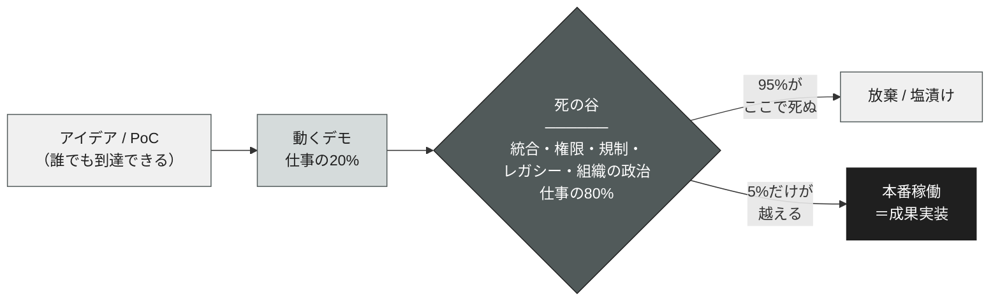
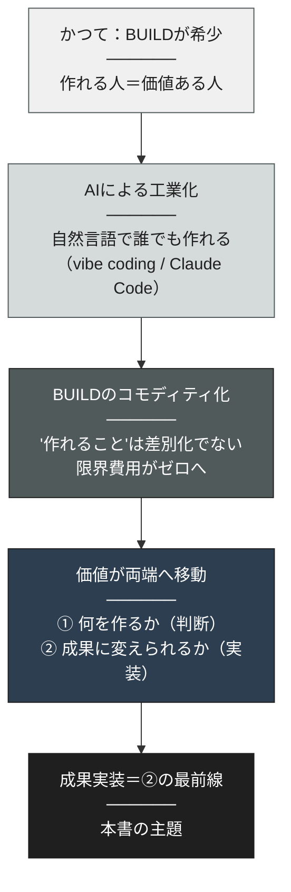
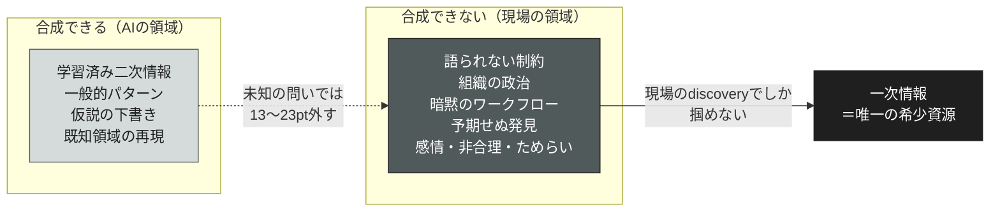
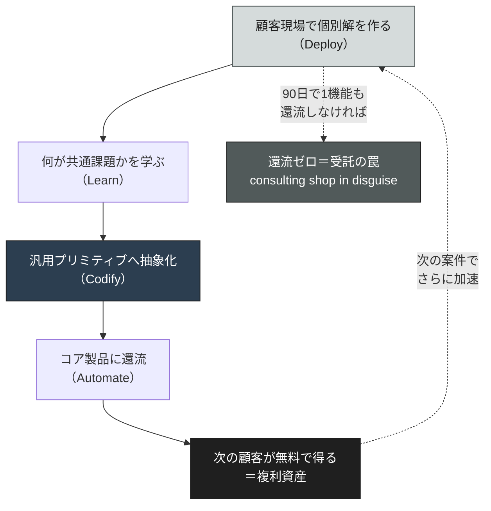
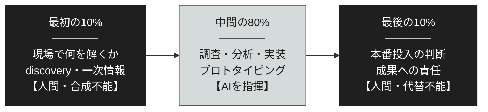
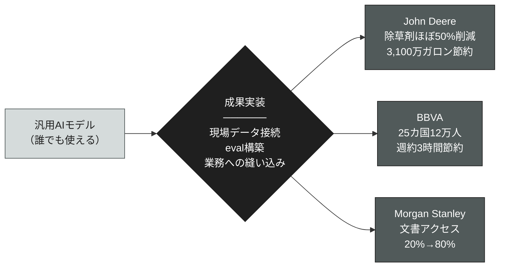

# 成果実装 ── FDEが示す、AIで「作る」が終わった世界の価値のありか

> **"Building is over. Deploying has just begun."**
> （作ることは、終わった。届けることが、いま始まった）

 

---

# 序章: 作る時代の終わり

2026年5月、わずか1週間の間に、AI業界の二大巨頭が、ほとんど同じ賭けに出た。

5月4日、Anthropicは、Blackstone、Hellman & Friedman、Goldman Sachsと組み、新しいエンタープライズAIサービス会社の設立を発表した。 
その狙いは、Claudeをミッドサイズ企業の中核業務に実装することにある。 
わずか1週間後の5月11日、OpenAIは「The Deployment Company」を立ち上げた。 
初期投資40億ドル超、19のパートナーを束ね、応用AIコンサルのTomoroを買収して約150人のエンジニアを初日から確保した。 
さらにGoogle Cloudも、CEOが顧客とパートナーの需要を理由に、同種の人材採用を加速していると公言している。

これは偶然の一致ではない。 
**AIを最も深く理解している企業群が、同じタイミングで、同じ結論に達した**ということだ。 
その結論とは——より賢いモデルを作るだけでは、もう足りない、というものだ。

両社が設立したのは、より賢いモデルを「作る」ための研究組織ではない。 
すでに作ったモデルを、顧客企業の現場に「届けて成果に変える」ための組織だ。 
OpenAIは設立の理由をこう述べている。 
強力なAIモデルを作ることは仕事の一部にすぎず、本当のインパクトは、 
人々と組織がそれを安全に、効果的に、スケールして使えるよう支援することから生まれる、と。

考えてみてほしい。 
世界最高のモデルを持つ企業が、自ら「モデルを作るだけでは価値は生まれない」と認めているのだ。 
これほど雄弁な、時代の証言はない。

なぜ、世界最先端のAI企業が、いま「作る側」ではなく「届ける側」に巨額の資本を投じるのか。 
本書は、この問いから始まる。

## ホットな職は、もはやモデルを作る者ではない

その答えは、ある職種の爆発的な需要に最も鮮明に表れている。 
**Forward Deployed Engineer（FDE）**——顧客の現場に入り込み、AIを実際の業務環境で動かす実装の主体者だ。 
日本語に直訳すれば「前線配備エンジニア」。 
本社の研究室からではなく、顧客の「前線」に配備され、そこで成果を出すまでを担う。

求人プラットフォームIndeedのデータをBusiness Insiderが報じたところによれば、 
FDEの求人は2025年4月から2026年4月にかけて前年同月比で約729%増加した。 
ここで一点、正確を期す。 
広く流通している「643件から5,330件へ」という数字は**実数ではなく、2025年1月を100とした指数値**である。 
（Business Insiderは当初これを実数と誤記し、後に訂正している） 
別系統のデータ（Live Data Technologies）では、前年比1,165%増という数字も出ている。 
基準期間も指数か実数かの定義も媒体ごとに異なるが、**「急増している」という方向はすべての一次データで一致している**。 
ベンチャーキャピタルa16zは、この職をスタートアップで最もホットな職と呼んだ。

なぜ正確さにこだわるのか。 
この種のブームでは、数字が独り歩きする。 
「643件が5,330件になった」という実数の物語は分かりやすく、拡散しやすい。 
だが、それは事実ではない。 
本書は、ブームに乗るためではなく、ブームの**構造**を理解するために書かれている。 
だからこそ、最初の数字から正確であることにこだわる。

重要なのは、急増の理由だ。 
a16zはこれを「採用ブーム」ではなく構造論として説明している。 
基盤モデルが交換可能になりアプリ層の所有が重要になるほど、ハンズオンの実装支援を持つ企業の方が耐久的になる—— 
つまり、**粗利（margin）を堀（moat）と交換する**戦略だと。 
モデルそのものより、それを顧客の現実に適合させる力の方が、希少で価値が高くなった。

## 本書が論じる「成果実装」とは何か

本書は、この構造変化を一語で捉える。**「成果実装」**だ。

成果実装とは、AIを「作る（BUILD）」のではなく、顧客の最前線で一次情報を掴み、 
個別解を再現可能な資産へと変えて、**実際の事業成果に変える力**を指す。

ここで、用語の射程を明確に定義しておく。 
本書の「成果実装」は、**新規・既存を問わず、顧客の事業を非連続に成長させる介在のすべて**を含む。 
既存の事業にAIを実装し、連続的な改善ではなく構造的な飛躍を起こすこと——それもまた、成果実装だ。 
FDEが主に立っているのは、むしろこちらの領域である。

なぜ「実装」という技術用語ではなく、あえて「成果実装」と呼ぶのか。 
それは、価値の源泉が「作ること」から「成果に変えること」へ移ったという、本書の中核命題を一語で背負わせるためだ。 
単にコードを書く「実装」ではない。 
顧客の事業に成果が出るところまでを引き受ける「成果実装」だ。 
この一語の差に、本書のすべてが詰まっている。

AIで「作る」は、2025年に工業化された。 
実装が万人に配られた瞬間、"作れること"は差別化ではなくなった。 
残ったのは、作ったものを顧客の混沌とした現実に縫い込み、成果に変える力だけだ。

| | BUILD（作る） | 成果実装（届けて成果に変える） |
|---|---|---|
| 担い手 | 誰でも（AIが代替・加速） | 顧客の最前線に立つ者 |
| 希少性 | 低い（コモディティ化） | 高い（暗黙知に依存） |
| 必要な情報 | 学習済みの二次情報 | 現場でしか得られない一次情報 |
| 成果物 | 動くデモ・プロトタイプ | 本番で動き、成果を出すシステム |
| 価値の源泉 | モデルの性能 | 現場の文脈への適合 |
| 代替可能性 | AIで代替できる | AIで代替できない |

## 本書の読者と地図

本書は、次の3者のために書かれている。

* 第一に、**エンタープライズAIの導入を任されたが、PoC止まりで本番に届かず悩んでいる人**。
事業会社のDX・AI推進部門、経営企画、情報システム部門。あなたが直面している壁には、構造的な名前がある。

* 第二に、**AI時代に自分の価値がどこに残るのかを問うているエンジニア・コンサルタント・事業開発者**。
FDEという職種名に惹かれた人も、その本質を職種ではなく構造として理解すれば、肩書きに関係なく価値を持てる。

* 第三に、**AIで何かをやれと言われたが、何をすればいいか分からない経営層・マネージャー**。
本書は、なぜ95%が失敗するのか、そして残り5%が何をしているのかを、一次データで示す。

本書の地図はこうだ。 
まず、なぜ95%のAIが現場で死ぬのかを見る（第1章）。 
次に、その手前で「作る」が工業化された構造を解剖する（第2章）。 
そして、谷を越える営み＝成果実装が20年前にPalantirで発明されていたことを示し（第3章）、 
その核心がdiscoveryという合成不能の工程にあることを論じる（第4章・本書の核）。 
続いて、それが受託に堕さず資産化する条件（第5章）、 
実践の方法論（第6章・本書の核）、 
既存事業での実証（第7章）へ進む。

この「成果実装」という希少性が、なぜ生まれ、どこに宿り、どうすれば持てるのか。 
一次データと現場の構造から、順に解き明かしていく。

### 参考文献

1. OpenAI「OpenAI launches the OpenAI Deployment Company」（2026年5月11日）
   <https://openai.com/index/openai-launches-the-deployment-company/>
2. Anthropic「Building a new enterprise AI services company with Blackstone, Hellman & Friedman, and Goldman Sachs」（2026年5月4日）
   <https://www.anthropic.com/news/enterprise-ai-services-company>
3. Business Insider「Forward-deployed engineer jobs are in demand」（2026年5月・指数値の訂正を含む）
   <https://www.businessinsider.com/forward-deployed-engineer-jobs-in-demand-2026-5>
4. Paraform / Live Data Technologies「Forward-Deployed Engineers: How Demand Grew 10x in 18 Months」（2026年4月・前年比1,165%）
   <https://www.paraform.com/blog/forward-deployed-engineer-demand-quadrupled>
5. a16z「Trading Margin for Moat: Why the Forward Deployed Engineer Is the Hottest Job in Startups」（2025年6月）
   <https://a16z.com/services-led-growth/>

 

---

# 第1章: 95%はなぜ現場で死ぬのか

AIへの投資は、史上類を見ない規模で続いている。 
だが、その投資は成果に変わっているのか。

2025年7月、MITのProject NANDAが発表したレポート「The GenAI Divide: State of AI in Business 2025」は、この問いに残酷な数字で答えた。 
**企業が生成AIに投じた推定300〜400億ドルに対し、約95%の組織が、損益（P&L）に測定可能なインパクトを出せていない。**  
急速な収益貢献を生んでいるのは、わずか5%だ。

この調査は、300件超の公開AI導入のレビュー、52組織への構造化インタビュー、153人の上級リーダーの回答に基づく。 
（Fortuneの報道では「150インタビュー＋従業員350調査＋公開300件分析」と表現され、調査規模の記述には差異がある点を付記しておく） 
サンプルの取り方に議論の余地はあるが、結論の方向性は揺るがない。

## 失敗の主因は、モデルではない

このレポートが投げかけた最も重要な指摘は、失敗率そのものではない。 
**失敗の原因**だ。

レポートは明言している。 
この分断（GenAI Divide）は、モデルの品質や規制によって生じているのではなく、「アプローチ」によって決まっている、と。 
失敗は、脆いワークフロー、文脈学習の欠如、日々のオペレーションとの不整合から生まれる。 
MITはこれを**「learning gap（学習ギャップ）」**と呼ぶ。

ここを取り違えてはならない。 
世間の議論は、AIの失敗を語るとき、すぐに「モデルがまだ賢くないからだ」「ハルシネーションがあるからだ」「規制が追いついていないからだ」と、技術や外部環境のせいにする。 
だが、最も網羅的な調査が示した答えは違う。 
**95%のAIが死ぬのは、モデルが賢くないからではない。賢いモデルを、顧客の現場という混沌に適合させられないからだ。**

具体的に、何が起きているのか。 
レポートが挙げる失敗の典型はこうだ。 
AIツールが、組織の文脈を学習できない。前回の指示を記憶しない。同じ間違いを繰り返す。 
既存のワークフローに統合されず、独立したツールとして孤立する。 
ユーザーは、個人で使うChatGPTの快適さに慣れているのに、会社が導入したAIは融通が利かず、結局使わなくなる。 
これらはどれも、モデルの知能の問題ではない。**現場への適合の問題**だ。

## 内製は、なぜ失敗するのか

このレポートには、本書の命題を直接裏付ける一次記述がもう一つある。 
**戦略的パートナーシップ（外部ベンダーとの提携）は、内製の2倍成功しやすい。**  
専門ベンダーからの購入・提携は約67%の確率で成功するのに対し、自前で作ろうとした内製は、その3分の1の成功率しかない。

これは直感に反するかもしれない。 
「自社の業務は自社が一番知っている。だから内製が有利なはずだ」——多くの企業がそう考え、自前でAIを作ろうとする。 
レポートの著者によれば、調査先のほぼどこでも、企業は自前のツールを作ろうとしていた。 
だが、データは逆を示した。

なぜか。 
自社の業務を知っていることと、それをAIで動くシステムに翻訳できることは、まったく別の能力だからだ。 
内製チームは、自社の業務には詳しいが、「AIを現場に適合させる」という成果実装の専門技術を持たない。 
一方、外部の実装パートナーは、多くの現場で同じ「適合」を繰り返してきた専門家だ。 
**"自分で作る"ことが、むしろ失敗の確率を上げている**——この事実は、本書全体を貫く逆説の出発点になる。

## 95%は、単一の数字ではない

「95%」という数字は衝撃的だが、これを唯一の根拠にすべきではない。 
一つの調査の一つの数字に依存する議論は、脆い。 
同じ「展開が壊れている」という現象を、複数の独立した調査が別の角度から裏付けている。 
それぞれサンプルも定義も異なるが、方向は一致している。

| 調査主体 | 指標 | 数値 |
|---|---|---|
| MIT NANDA（2025） | P&Lに効果なし | 約95%（5%のみ急速な収益貢献） |
| Gartner（2024予測） | PoC後に放棄されるGenAIプロジェクト | 2025年末までに少なくとも30% |
| BCG（2025） | AIから価値を生めている企業（future-built） | 5%（60%はほぼ価値を得られず） |
| IDC / Lenovo（2025・APJ） | PoCに対する本番投入 | 平均23件のPoC → 3件が本番／成功と見なされたPoCは全体の1割未満 |

数字のレンジは調査ごとに揺れる。 
30%、95%、5%——一見すると矛盾しているようにも見える。 
だが、それぞれが測っているものは異なる（放棄率、P&L効果、価値創出企業の割合、本番投入率）。 
測定対象が違えば数字が違うのは当然だ。 
重要なのは、**どの角度から見ても「PoCは溢れているのに、本番で価値に変わらない」というボトルネックが、**  
**技術側ではなく展開側にある**という結論に収束している点だ。

本書が単一の「95%」に寄りかからず、 
複数の調査を併置するのは、この収束こそが信頼できる事実だからだ。 
数字は揺れる。だが、構造は揺れない。

## 死の谷は「作る」と「届ける」の間にある

従来、AI導入の難所は「モデルを作れるか」だと考えられてきた。 
だが、データが示すのは逆だ。 
デモが動くことは、もはや難所ではない。 
難所は、その先にある。

この「死の谷」こそが、本書の主題だ。 
デモをサンドボックスで動かすのは仕事の2割にすぎない。 
残りの8割は、エンタープライズの認証基盤（SSO/SAML）との接続、レガシーなETLパイプラインの統合、 
データ所在地や監査の規制制約、そして顧客のセキュリティチームから本番権限を取りに行く組織内の政治だ。

想像してみてほしい。 
あなたがAIエージェントのデモを作り、顧客の役員に見せた。 
役員は感嘆する。「素晴らしい。これを来週から全社で使えるようにしてくれ」。 
だが、ここからが本番だ。 
顧客の認証基盤は10年前のシステムで、APIドキュメントは存在しない。 
必要なデータは3つの部署に分かれて管理され、そのうち1つは「セキュリティ上の理由」で誰も触れない。 
本番のクレデンシャルを得るには、情報システム部の承認が要るが、彼らは「出所不明のツールは社内ネットワークに繋げない」と言う。 
デモの輝きは、この現実の前で急速に色褪せる。

プロンプトをいくら磨いても、この谷は越えられない。 
谷を越えるのに必要なのは、より賢いモデルではない。 
顧客の現場に立ち、その混沌の構造を一次情報で掴み、個別の解を本番に縫い込む力——**成果実装**だ。

具体的に、「8割の仕事」とは何か。 
デモが動いた後、本番までに立ちはだかる障害を列挙すると、その質量が見えてくる。

- **認証・認可**：
  顧客のSSO/SAML基盤との接続。誰がどのデータにアクセスできるかの権限設計。
- **データ統合**：
  複数部署に散在するデータ、ドキュメントのないレガシーAPI、形式の揃わないデータの名寄せ。
- **規制・コンプライアンス**：
  データ所在地の制約、監査ログの要件、人間による検証（Human-in-the-Loop）の組み込み。
- **本番権限の取得**：
  情報システム部・セキュリティチームとの折衝。これは技術ではなく、組織内の政治だ。
- **現場の定着**：
  現場が実際に使うか。既存の業務フローにどう組み込むか。使われなければ、どれだけ動いても成果はゼロだ。

これらはすべて、モデルの賢さとは無関係だ。 
そして、これらはすべて、顧客ごとに固有である。汎用の正解はない。 
現場に立って、その顧客の固有の地形を掴むしかない。 
これが、第4章で詳しく論じる「成果実装の本体」だ。

95%が死ぬ場所は、AIを作る研究室ではない。 
AIを届ける、顧客の最前線である。

次章では、なぜ「作る（BUILD）」がここまで安価になり、 
価値が谷の向こう側へ移ったのか——その工業化の構造を解剖する。

### 参考文献

1. MIT Project NANDA「The GenAI Divide: State of AI in Business 2025」（2025年7月・レポート本体）
   <https://mlq.ai/media/quarterly_decks/v0.1_State_of_AI_in_Business_2025_Report.pdf>
2. Fortune「MIT report: 95% of generative AI pilots at companies are failing」（著者Challapally本人インタビュー付き）
   <https://fortune.com/2025/08/18/mit-report-95-percent-generative-ai-pilots-at-companies-failing-cfo/>
3. Gartner「Gartner Predicts 30% of Generative AI Projects Will Be Abandoned After Proof of Concept By End of 2025」（2024年7月）
   <https://www.gartner.com/en/newsroom/press-releases/2024-07-29-gartner-predicts-30-percent-of-generative-ai-projects-will-be-abandoned-after-proof-of-concept-by-end-of-2025>
4. BCG「Are You Generating Value from AI? The Widening Gap」（2025）
   <https://www.bcg.com/publications/2025/are-you-generating-value-from-ai-the-widening-gap>
5. Bain & Company「Executive Survey: AI Moves from Pilots to Production」
   <https://www.bain.com/insights/executive-survey-ai-moves-from-pilots-to-production/>

 

---

# 第2章: BUILDの工業化 ── なぜ「作れること」は価値でなくなったのか

死の谷の手前——「作る」側で、何が起きたのか。

答えは一言で言える。 
**AIで「作る（BUILD）」は、工業化された。**  
かつて専門エンジニアが数週間かけたプロトタイプを、いまは自然言語の指示で数時間で生成できる。 
コードを書く能力は、一部の専門家の希少資源から、誰もが使える公共財へと変わった。

## 「作る人」と「考える人」の境界が消えた

この変化の本質は、**「考える人」と「作る人」の分離が消えた**ことにある。

従来、新規事業やAI導入のプロセスはこうだった。 
事業を考える人がいて、要件を文書化し、それをエンジニアに渡す。 
エンジニアが実装し、数週間後にプロトタイプが返ってくる。 
だが、出来上がったものは、考えた人のイメージとずれている。 
修正を依頼し、さらに数週間が失われる。 
この「考える人」と「作る人」の間の翻訳ロスと時間ロスが、あらゆるプロジェクトの足を引っ張っていた。

バイブコーディング（Vibe Coding）——AIに自然言語で指示してコードを書かせる手法——は、この分離を消した。 
考える人が、そのまま作る人になれる。 
OpenAI共同創業者のAndrej Karpathyが名付けたこの手法、 
そしてAnthropicのClaude Codeをはじめとするツール群は、 
プロトタイプ生成のコストを劇的に押し下げた。 
思いついたアイデアを、午前中に動くものにし、午後には顧客に見せる。 
そんなサイクルが現実になった。

私はこの構造を、別稿「AIがあれば誰でも作れる時代の、2つの空白地帯」で論じた。 
要点はこうだ。 
AIが実装（BUILD）を埋めた結果、価値は両端の空白——**①何を作るか（最初の判断）と、②それは本当か（最後の検証）**——に移った。 
中央の「作る」は、もはや空白ではない。AIが埋めてしまった。 
本書は、この「それを成果に変える」側を、エンタープライズAI導入の最前線で捉え直すものだ。

## 数週間が、数時間になった

この変化の規模を、具体的な時間軸で捉えてみよう。

従来、新規事業の担当者がアイデアを思いついてから、 
それを顧客に見せられる動くプロトタイプにするまで、何が必要だったか。 
まず要件を文書化する（数日）。 
エンジニアのリソースを確保するための社内承認を取る（数日〜数週間）。 
エンジニアが実装する（数週間）。 
出来上がったものをレビューし、ずれを修正する（さらに数週間）。 
合計で、最短でも1〜2ヶ月。 
その間に、市場は動き、競合は先行し、最初の仮説は古びていく。 
完成した頃には「それ、もう別のサービスが出ていますよ」と言われる。

バイブコーディングは、この1〜2ヶ月を、数時間に圧縮した。 
担当者が、自分で、その日のうちに、動くプロトタイプを作る。 
午前中にアイデアを形にし、午後には顧客の前で動かす。 
反応が悪ければ、その場で直すか、捨てて作り直す。 
「正解を見つけるために、大量に作って大量に捨てる」——本来のアジャイルが、ついに現実になった。

ここで強調したいのは、速くなったことそれ自体ではない。 
**速くなったことで、ボトルネックの所在が移動した**ことだ。 
作るのに1ヶ月かかっていた時代、ボトルネックは明らかに「作ること」だった。 
だが、作るのが数時間になった瞬間、ボトルネックは「何を作るべきか（最初の判断）」と、 
「作ったものをどう本番に届けるか（成果実装）」へ移った。 
律速段階が変われば、価値の所在も変わる。

## 「作る」のコストがゼロに近づいた

ベンチャーキャピタルa16zは、この変化を投資家の言葉で言い換えている。 
基盤モデルが交換可能になり、誰もが同じ土台の上で作れるようになるほど、「作れること」自体は競争優位ではなくなる。 
差別化は、作ったものを顧客の現実に**実装して成果に変える**ハンズオン支援の側へ移る。 
a16zはこれを、粗利（margin）を堀（moat）と交換する戦略と呼んだ。

ソフトウェアのコストが下がると何が起きるか。 
経済学の基本だ。 
**コモディティ化したものの価格は、限界費用に向かって下落する。**  
作ることの限界費用がゼロに近づいた以上、「作れること」だけでは、もう対価を取れない。 
対価が取れるのは、希少なものに対してだけだ。 
そして、いま希少なのは——作ったものを、混沌とした現実の中で成果に変える力である。

ここに、本書の出発点がある。 
「作れること」がコモディティ化したからこそ、「作ったものを成果に変えられること」が、唯一の希少性になった。

## 工業化が暴いた「本当の難所」

BUILDが安価になったことで、皮肉な事実が露わになった。 
**プロジェクトの本当の難所は、最初から「作ること」ではなかった**のだ。

これまで、「作ること」が難しかったために、その難しさが他のすべての難所を覆い隠していた。 
プロトタイプを作るだけで数週間かかっていた時代には、「作った後にどう本番へ届けるか」を考える前に、力尽きていた。 
だが、作ることが数時間に縮んだ瞬間、覆いが外れた。 
その下から現れたのは、ずっとそこにあったのに見えていなかった「8割の難所」——統合、権限、規制、レガシー、組織の政治——だった。

たとえるなら、これまでは険しい山の登り口（BUILD）があまりに急峻で、誰もその先の道のり（DEPLOY）を見ていなかった。 
AIが登り口に階段を架けた。誰もが登り口を越えられるようになった。 
すると初めて、その先に本当の難所——切り立った谷——が広がっていることが、全員に見えるようになったのだ。

第1章で見た95%の死は、ここで起きる。 
作ることが簡単になった分だけ、作った後の谷が、相対的に深く、そして明確に見えるようになった。

次章では、この谷を越える営み——成果実装——が、実は20年前から存在し、 
ある企業がそれを構造として確立していたことを見る。

### 参考文献

1. 山内怜史「AIがあれば誰でも作れる時代の、2つの空白地帯」（note）
   <https://note.com/satoshi_yamauchi/n/nca6060af22dd>
2. a16z「Trading Margin for Moat: Why the Forward Deployed Engineer Is the Hottest Job in Startups」
   <https://a16z.com/services-led-growth/>
3. Depth & Velocity ── 生成AI時代の新規事業開発方法論（Leading AI）
   <https://github.com/Leading-AI-IO/depth-and-velocity>

 

---

# 第3章: 成果実装とは何か ── Palantirが20年前に発明していた構造

OpenAIとAnthropicが2026年に同時に飛びついた「成果実装」の構造は、実は新しくない。 
20年前に、ある一社がそれを発明していた。**Palantir**だ。

## なぜ通常のSaaSが通用しなかったのか

Palantirが相手にした最初の顧客は、CIAや国防総省といった情報機関だった。 
これらの組織には、通常のソフトウェア企業が前提とする条件が、ことごとく欠けていた。

第一に、**要件を明示できない**。 
何が課題かを、顧客自身が言語化できない。 
あるいは、機密上、言語化できても外部に伝えられない。 
第二に、**データを共有できない**。 
セキュリティ上、データを外部に出せないため、エンジニアが顧客の環境の中に入るしかない。 
第三に、**ワークフローが常時変化する**。 
一度作った要件が、翌週には無効になる。

このような顧客に、外からパッケージソフトを売る通常のSaaSモデルは、まったく通用しない。 
要件が固まらないのだから、仕様書も書けない。 
データが出せないのだから、外部で開発もできない。

そこでPalantirが生み出したのが、**エンジニアを顧客の現場に数ヶ月単位で常駐させる**モデルだった。 
外から売るのではなく、中に入る。 
仕様書を待つのではなく、現場で要件を発見する。 
これが、後にForward Deployed Engineeringと呼ばれる構造の原型だ。

## Echo と Delta ── 現場に住み込む二つの役割

Palantirは公式ブログで、この役割を2つに整理している。 
コードを書き本番システムを構築する**「Delta」**と、 
ドメインを理解し問題を発見し関係を管理する**「Echo」**だ。

Deltaは、顧客の環境の中で、本番で動くコードを書く。 
通常の開発者が「多くの顧客のために1つの機能」を作るのに対し、 
Deltaは「1つの顧客のために多くの機能」を作る。 
この非対称性が重要だ。 
汎用製品の開発者は、最大公約数の機能を作る。 
Deltaは、目の前の1顧客の固有の現実に、徹底的に最適化する。

Echoは、コードを書かない。 
代わりに、顧客の業務を理解し、ワークフローを設計し、 
ユーザーと高速に反復し、現場のキーパーソンとの関係を管理する。 
Echoの典型的な仕事は、顧客のオペレーションの理解、 
既存システムの隙間を埋めるワークフロー設計、上級ステークホルダーのマネジメントだ。

元Palantir幹部でOpenAIのCROも務めたBob McGrewは、 
この本質を**「Productized Consulting（プロダクト化されたコンサルティング）」**と表現した。 
コンサルティングのように深く顧客に入り込みながら、その成果を製品として再利用可能にする—— 
この一見矛盾する2つを両立させることが、成果実装の核心だ。

## 砂利道を、舗装道路に変える

だが、ここに罠がある。 
「1つの顧客のために多くの機能」を作り続ければ、それは個別受託の山になり、複利が効かない。 
10社の顧客がいれば、10通りの作り込みが残り、保守不能な技術的負債の山ができる。 
これでは、ただの高級な受託開発だ。

Palantirが偉大だったのは、この個別解を**コア製品のプリミティブへ昇華するフィードバックループ**を設計した点にある。 
Palantirはこれを「砂利道（gravel road）を舗装道路（paved highway）に変える」と表現する。 
最初の顧客のために泥臭く作った個別解（砂利道）の中から、汎用化できる部分を見つけ出し、コア製品の機能（舗装道路）へと一般化する。 
次の顧客は、その舗装道路を無料で通れる。

この仕組みがあるからこそ、Palantirの成果実装は、受託ではなく事業になった。 
各案件が製品を育て、育った製品が次の案件を楽にする。 
この複利が、Palantirを時価総額1000億ドル超の企業へと押し上げた原動力の一つだ。

成果実装とは、この一連の構造だ。 
**顧客環境に入り、暗黙知を一次情報として掴み、個別解を作り、それを再現可能な資産へ還す。**  
FDEは、この構造に2026年のAI業界がつけた新しい名前にすぎない。

| 役割 | 担当 | 比喩 | 成果実装での意味 |
|---|---|---|---|
| Delta | 本番コードの実装 | 1顧客に多機能 | 現場で動くものを作る |
| Echo | ドメイン理解・関係管理 | 砂利道の発見 | 一次情報・暗黙知を掴む |
| 製品還元 | 個別解の一般化 | 舗装道路への昇華 | 受託を複利資産に変える |

## なぜ、いま再発見されたのか

20年前にPalantirが解いたこの構造が、なぜ2026年に再発見されたのか。

答えは、第1章・第2章で見たとおりだ。 
AIで「作る」が工業化され、価値が「成果に変える」側へ移った。 
そして、エンタープライズAIの95%が死の谷で死んでいる。 
この谷を越えるには、Palantirが情報機関相手に編み出した、 
「現場に入り、要件を発見し、個別解を製品に還す」構造が、そのまま必要になる。

興味深いのは、かつてPalantirの顧客が抱えていた3つの困難—— 
要件を明示できない、データを共有できない、ワークフローが常時変化する——が、 
いまやあらゆる企業のAI導入で再現されていることだ。 
AIエージェントを導入しようとする企業は、何を自動化すべきか正確には言語化できない（要件を明示できない）。 
機密データや個人情報をモデルの学習に出せない（データを共有できない）。 
そして、AIの能力が数ヶ月ごとに進化するため、最適な使い方が常に変わる（ワークフローが常時変化する）。 
20年前は情報機関だけが抱えていた特殊な困難が、いまやAIを導入するすべての企業の標準的な困難になった。 
だからこそ、Palantirの解——成果実装——が、業界全体で再発見されている。

a16zは2026年、この現象が業界全体に広がることを「The Palantirization of Everything（あらゆるもののPalantir化）」と呼んだ。 
OpenAIのThe Deployment CompanyもAnthropicの合弁も、20年前にPalantirが解いた構造を、AI時代に再実装したものだ。 
違いは、当時の顧客が情報機関だったのに対し、いまは、あらゆる業界のあらゆる企業がその顧客になった、という点だけである。

### 参考文献

1. Palantir「Dev versus Delta: Demystifying engineering roles at Palantir」（公式ブログ）
   <https://blog.palantir.com/dev-versus-delta-demystifying-engineering-roles-at-palantir-ad44c2a6e87>
2. Palantir「A Day in the Life of a Palantir Deployment Strategist」（公式ブログ・Echo）
   <https://blog.palantir.com/a-day-in-the-life-of-a-palantir-deployment-strategist-951cb59a5a96>
3. a16z「The Palantirization of Everything」
   <https://a16z.com/the-palantirization-of-everything/>
4. The Palantir Impact ── パランティアのオントロジー戦略（Leading AI）
   <https://github.com/Leading-AI-IO/palantir-ontology-strategy>

 

---

# 第4章: discoveryは合成できない ── 一次情報という、唯一の希少資源

本書の核心は、この章にある。

これまでの章で、価値が「作る」から「成果に変える」へ移ったこと（第2章）、 
その営みをPalantirが構造化していたこと（第3章）を見てきた。 
では、成果実装の全工程のうち、**AIが最も代替できない一点はどこか**。

それは**discovery——顧客の現場で、語られない本当の課題を掘り当てる工程**だ。

この章で、私はこう主張する。 
**discoveryは、合成できない。**  
だからこそ、それは成果実装における唯一にして最大の希少資源であり、AI時代に人間が握り続けられる、最後の砦である。

## 顧客は、本当の課題を知らない

成果実装の出発点は、顧客の課題を理解することだ。 
だが、ここに最初の、そして最大の罠がある。 
**顧客は、自分の本当の課題を知らない。**

これは顧客が無能だという意味ではない。 
人間は、自分が日々やっていることのほとんどを、言語化できない。 
熟練の職人が、なぜその一手を選んだのかを説明できないように。 
ベテランの営業が、なぜその顧客に響いたのかを正確に語れないように。 
現場の知は、その大半が**暗黙知（tacit knowledge）**——言葉にならない、身体化された知——として存在する。

要件定義の学術研究は、この問題を古くから扱ってきた。 
暗黙知は属人的かつ文脈依存的であり、当事者自身すら言語や数値で正確に表現できない。 
ドキュメントに書けない知識は、ドキュメントからは抽出できない。 
だから、顧客に「課題は何ですか」と尋ねて返ってくる答えは、氷山の一角——言語化できる表層——にすぎない。 
本当の課題は、水面下の暗黙知の中にある。

## 最良のブロッカーは、語られない

FDEのワークフローを調査すると、彼らは時間の最大40%をdiscoveryに費やしている。 
これは前座ではない。 
week-1のdiscoveryの深さが、その後の全工程の価値を決める。 

なぜ、それほどまでにdiscoveryに時間をかけるのか。 
実務の現場からは、こんな証言がある。 
エンタープライズ顧客は、綺麗なアーキテクチャ図を渡してはくれない。 
彼らが渡すのは現実——時代遅れのシステム、部署ごとに散らばった部族知（tribal knowledge）、 
ドキュメント化されていないAPI、複数のツールに分散したデータ。 
そして、最も重要なことに、**最良のブロッカーは語られず、発見される（discovered, not spoken）**。

この一句が、discoveryの本質を突いている。 
プロジェクトを止める本当の障害—— 
たとえば「このデータは政治的な理由で部署Aが絶対に渡さない」、 
「この承認プロセスには表に出ていないキーパーソンがいる」、 
「現場は公式手順を無視して独自ルールで回している」—— 
これらは、要件定義の会議では決して語られない。 
語られないから、フォームにも、ドキュメントにも、キックオフ資料にも載らない。 
現場に張り付いて、初めて発見される。

私は別稿「AIにユーザーインタビューはさせるな（0次インタビュー）」で、 
この工程が合成できない理由を構造的に論じた。 
AIに顧客インタビューを代行させようとする動きが広がっているが、それは原理的に、現場の暗黙知に到達できない。 
インタビューの前に、現場に立つ「0次」の観察がなければ、何を問うべきかすら分からないのだ。

## 合成ユーザーは、なぜ代替にならないのか

「ならばAIに合成ユーザー（synthetic users）を作らせ、インタビューを代替させればいい」—— 
この誘惑は、近年とりわけ強い。 
LLMで仮想の顧客を生成し、市場調査やUXリサーチを代替する試みが急速に広がっている。 
コストはゼロに近く、24時間動き、何千人分でも生成できる。 
一見、完璧な解に見える。

だが、学術研究はその限界を明確に示している。

第一の限界は、**構造的なものだ**。 
LLMは、訓練分布に統計的に適合するテキストしか生成できない。 
言い換えれば、LLMは「ありそうな答え」しか返せない。 
だが、新規事業やAI導入で価値を生むのは、「ありそうな答え」ではない。 
誰も予期していなかった発見——正規分布の中央ではなく、その外れにある異常値——だ。 
**合成ユーザーは、本当に予期せぬ発見を、構造的に生み出せない。**  
訓練データの平均に回帰するからだ。

第二の限界は、**記憶（memorization）の罠だ**。 
ある実務検証では、合成研究が既存の調査結果を高い相関で再現したように見えた。 
一見、合成ユーザーが有効である証拠に見える。 
だが、その正体は、元のレポートが長年公開され、LLMの訓練データに含まれていた「記憶」の再生だった。 
つまり、答えを知っているテストを解いていたにすぎない。 
決定的なのは、**訓練データに無い新しい問いに対しては、合成ユーザーは13〜23ポイントも実際の人間の回答から外した**ことだ。 
既知の領域では正解を再生し、未知の領域では大きく外す。 
これは、新規の発見を求めるdiscoveryにとって、最悪の性質である。

第三の限界は、**感情と非合理の欠落だ**。 
現場の人間は、論理的でない行動をとる。 
非合理な抵抗をし、説明できない違和感を抱き、言葉にしない「ためらい」を示す。 
だが、これらの非合理・感情・ニュアンスこそが、次の成果実装の種になる。 
合成ユーザーは、統計的な中央値へ回帰するため、こうした人間の機微を再現できない。

ここで誤解を避けたい。 
合成ユーザーが無価値だと言っているのではない。 
それは、仮説の下書き、インタビュー設計のテスト、既知領域の補完には使える。 
問題は、それを**本番の判断を支える一次情報の代わりにすること**だ。 
合成手法は補助線であって、現場の代替ではない。

## 現場でしか見えない、3つの層

discoveryが何を掴むのかを、3つの層に分けて具体化しよう。 
表層から深層へ、AIが届かなくなっていく。

**第1層：語られる課題（表層）。** 
「レポート作成に時間がかかる」「問い合わせ対応が多い」。 
顧客が会議で口にする課題。 
ここはAIでも拾える。誰でもアクセスできる、平均的な課題だ。 
だが、ここだけを解いても、第1章の95%に入る。 
なぜなら、この層の課題は、たいてい本当のボトルネックではないからだ。 

**第2層：観察される現実（中層）。** 
現場に立って初めて見える。 
公式手順書には「Aの後にBを実行」と書いてあるが、現場は実際にはAを飛ばしてCで代用している。 
なぜなら、Aを実行するシステムが遅すぎて、現場が独自の回避策を編み出したからだ。 
この「公式と現実の乖離」は、誰も文書化していない。 
現場を観察した者だけが掴める。

**第3層：語られない制約（深層）。** 
最も深く、最も決定的な層。 
「このデータは、部署Aと部署Bの長年の対立があって、絶対に共有されない」、 
「この承認には、組織図に出てこないキーパーソンの暗黙の了解が要る」、 
「現場は本社の新しい方針を、表向き従いつつ実際には無視している」。 
これらは、政治であり、感情であり、歴史だ。 
インタビューで直接問うても、絶対に出てこない。 
長く現場に張り付き、信頼を得て、断片から推し量って、ようやく発見される。

成果実装の成否は、第3層をどれだけ掴めるかで決まる。 
そして第3層は、定義上、いかなるドキュメントにもインターネットにも存在しない。 
AIの学習データに、あるはずがない。

## learning gapの正体

第1章で、MIT NANDAが失敗の主因を「learning gap（学習ギャップ）」と呼んだことを見た。 
この章の議論は、その正体を明らかにする。

learning gapとは、AIが現場の文脈を「学習できない」ことだと思われがちだ。 
だが、より正確に言えばこうだ。 
**現場の文脈は、そもそも誰も書き記していない。だから、学習データに存在しない。**  
AIは、存在しないデータからは学べない。

つまり、learning gapは技術の問題ではない。 
情報の所在の問題だ。現場の暗黙知は、ドキュメントにもインターネットにも存在しない。 
それは、現場にいる人間の頭と身体の中にしかない。 
それを引き出せるのは、現場に立ち、観察し、対話し、「語られないもの」を発見できる人間だけだ。

これが、成果実装の希少性の、最も深い源泉である。 
AIがどれだけ賢くなっても、世界中の二次情報を学習し尽くしても、 
あなたが昨日の現場で見た、あの担当者の一瞬のためらいは、AIの学習データには存在しない。 
それは、あなただけが持つ一次情報だ。

## discoveryは、技術ではなく態度である

最後に、実践的な核心を述べる。 
discoveryは、特殊な技術ではない。 
それは**態度**だ。

顧客の言葉を額面通りに受け取らない態度。 
「課題は何ですか」と問う代わりに、現場に立って「実際に何が起きているか」を観察する態度。 
会議室の整然とした説明より、現場の混沌とした現実を信じる態度。 
語られたことより、語られなかったことに注意を向ける態度。

第6章で詳しく見るが、この態度を方法論として体系化したものが、 
Depth & Velocityの「一次情報×LLMの仮説検証サイクル」だ。 
現場で一次情報を掴み、それをAIに投げて仮説を磨き、再び現場で検証する。 
地図（AI）と地形（現場）を往復する。 
このサイクルの起点は、常に現場のdiscoveryにある。

次章では、こうして掴んだ個別解が、受託の山に終わるか、複利の資産になるか——その分岐点を論じる。

### 参考文献

1. 山内怜史「AIにユーザーインタビューはさせるな（0次インタビュー）」（note）
   <https://note.com/satoshi_yamauchi>
2. Park et al.「'Simulacrum of Stories': Examining Large Language Models as Qualitative Research Participants」（arXiv 2409.19430）
   <https://arxiv.org/abs/2409.19430>
3. Nielsen Norman Group「Synthetic Users: If, When, and How to Use AI-Generated Research」
   <https://www.nngroup.com/articles/synthetic-users/>
4. The Voice of User「The largest review of synthetic participants ever conducted」
   <https://www.thevoiceofuser.com/the-largest-review-of-synthetic-participants-ever-conducted-found-exactly-what-youd-expect-synthetic-users-dont-work/>
5. FDE Tech Stack 2026（discovery比重の実務記述）
   <https://getperspective.ai/blog/fde-tech-stack-2026-tools-forward-deployed-engineers-actually-ship>

 

---

# 第5章: 受託と資産化を分けるもの ── productizationという分岐点

成果実装には、致命的な失敗モードがある。 
**「SaaSの看板を掲げただけの受託開発（consulting shop in disguise）」**へ堕することだ。

第3章で、Palantirが「砂利道を舗装道路に変える」フィードバックループによって、個別解を複利資産にしたことを見た。 
だが、このループを設計し損ねると、成果実装は容易にただの受託へ転落する。 
本章は、その分岐点を論じる。

## すべての案件が個別仕様なら、それは製品ではない

a16zは警告する。 
すべての取引に固有の作り込みが必要なら、それはプロダクトではなく、ロゴのついたコンサルティング会社だ、と。 
さらに、FDE部隊を製品から切り離して独立したサービス部門にすると、 
製品へのフィードバックループが失われ、純粋なサービス業へと漂流する、とも指摘する。

この転落は、静かに進行する。 
最初は、目の前の顧客を満足させるために、少し個別の作り込みをする。 
それが成功する。 
次の顧客にも、また少し作り込む。 
気づけば、顧客ごとに別のコードベースが乱立し、どれも保守不能になっている。 
売上は立つが、利益は出ない。 
エンジニアは既存顧客の保守に追われ、製品は育たない。 
**これが、ソフトウェアの皮をかぶった労働集約型ビジネスの末路だ。**

例えば、ある引き合いで、単独では自社の事業として成立せず、顧客固有の作り込みだけが残る案件があったとしよう。 
短期的には売上になる。 
だが、それは複利の効かない受託であり、製品を育てない。 
私はそれを見送るだろう。 
「自社単独で成立しない、製品に還らない介在は受けない」—— 
この判断基準は、本章で論じる productization の論理と、まったく同じ構造をしている。

## 受託と資産化を分ける、計測可能な線

では、受託と資産化を分ける線はどこにあるのか。 
感覚ではなく、計測指標で語れる。

その前に、最も多い組織設計の失敗を指摘しておく。 
それは、**成果実装の部隊を、営業組織（GTM）の下に置くこと**だ。 
営業のインセンティブは「目先の大型契約を閉じること」にある。 
その下に成果実装の担い手を置けば、彼らは契約を取るために、顧客ごとの個別作り込みを際限なく続けることになる。 
製品ロードマップから乖離した、保守不能な技術的負債の山が積み上がる。 
先進的なプレイブックは、成果実装の部隊を営業ではなく製品・エンジニアリングの下に置くべきだと説く。 
なぜなら、成果実装の目的は「契約を閉じること」ではなく「現場の学びを製品に還すこと」だからだ。 
配置を間違えると、計測指標を見る前に、構造的に受託へ傾く。

第一の指標は、**productization rate（製品還元率）**だ。 
FDE運用の先進的なプレイブックは、 
これを「1つの案件から、コア製品に還流する機能が最低1つ、90日以内に生まれること」と定義し、 
機能が健全に回っているかの最重要先行指標と位置づける。 
各案件の終わりに問う。 
「この案件から、次の顧客が無料で使える機能が、最低1つ生まれたか？」。 
答えがイエスなら、それは舗装道路を1本敷いたことになる。 
ノーなら、それは砂利道のまま放置された——つまり受託だ。

第二の指標は、**個別作り込みの比率**だ。 
投資ファンドF-Primeは閾値を示す。 
経験則として、展開の30〜40%超が重大な個別作り込みを要するなら、 
問題はもはや営業（GTM）ではなく製品設計だ、と。 
3割を超える個別作り込みが常態化しているなら、 
それは「製品が未成熟だから毎回作り込まねばならない」というサインであり、組織は受託へ傾いている。

このフライホイール——Deploy（現場展開）→ Learn（学習）→ Codify（抽象化）→ Automate（製品化）—— 
が回って初めて、成果実装は受託から事業へ転換する。 
重要なのは、現場での泥臭い作り込みを「顧客対応」としてではなく、「R&Dの最前線」として扱う視点だ。 
現場は、製品を育てるための一次情報の源泉である。

## 既存コンサルすら、実装の側へ降りてきた

この分岐の重要性は、伝統的コンサルの動きが、何よりも雄弁に証明している。

2026年、EYは英国・アイルランドでForward Deployed Engineer職を正式に新設した。 
大手コンサルとして、このモデルを公式に採用した初期の事例だ。 
Deloitteも「Forward Deployed Engineering」を正式サービスとして開始し、 
停滞したパイロット、低い定着率、AI人材の不足を解決すべき課題に掲げた。 
AccentureはMicrosoftと組んでFDE専門組織を立ち上げ、構想から本番への移行を数ヶ月から数日へ短縮すると謳う。

これは、業界の地殻変動を示している。 
**スライドを納品するアドバイザリーモデルの代表格だった企業群が、自ら本番コードを書く実装の側へ降りてきている。**  
一方で、OpenAIやAnthropicのようなAI企業は、モデルを売る側から、実装を担う側へと降りてきている。 
コンサルは上から、AI企業は下から、同じ「成果実装」という一点で正面衝突しつつある。

この衝突が意味するのは一つだ。 
「成果は、提言（スライド）でも、汎用API（製品）でもなく、顧客の環境で動き、複利資産へ還る成果実装からしか生まれない」—— 
市場全体が、この結論に収束している。

### 参考文献

1. Perspective AI「The Forward Deployed Engineer Playbook（2026）」（productization rate）
   <https://getperspective.ai/blog/the-forward-deployed-engineer-playbook-how-to-structure-run-and-scale-an-fde-function-in-2026>
2. F-Prime Capital「The Uncomfortable Truth About FDEs」（30〜40%閾値）
   <https://fprimecapital.com/blog/the-uncomfortable-truth-about-fdes/>
3. EY「EY launches Forward Deployed Engineer AI roles」（2026年4月）
   <https://www.ey.com/en_uk/newsroom/2026/04/ey-launches-fde-roles>
4. Deloitte「Announcing Forward Deployed Engineering」
   <https://www.deloitte.com/us/en/services/consulting/articles/announcing-forward-deployed-engineering.html>
5. The Structural Shift from SaaS to Service-as-a-Software（Leading AI）
   <https://github.com/Leading-AI-IO/saas-is-dead-the-next-ai-business-model>

 

---

# 第6章: 成果実装の方法論 ── D&Vを現場へ適用する

ここまで、成果実装が「なぜ希少か」を論じてきた。 
本章は、もう一つの核として「どうすれば持てるか」を扱う。

結論から言う。 
成果実装の方法論は、新たに発明する必要がない。 
私が生成AI時代の新規事業開発方法論として体系化した**Depth & Velocity（D&V）**が、そのまま成果実装のOSになる。 
D&Vは「新規事業のOS」であると同時に、「最前線で成果を出すOS」でもあるからだ。

なぜ同じOSが両方に効くのか。 
第1章で見たとおり、本書の「成果実装」は新規・既存を問わない非連続成長の介在を指す。 
新規事業の0→1も、既存事業へのAI実装も、効く工程は同じだ—— 
現場で一次情報を掴み、何を作るかを判断し、AIで高速に作り、本番で成果に責任を持つ。 
D&Vは、この工程を貫く思考のOSである。

## D&Vの4要素を、成果実装の現場に対応させる

D&Vの中核要素は、成果実装の各工程に、ほぼ一対一で対応する。 
まず全体像を示す。

| D&Vの要素 | 成果実装での役割 | 対応する工程 |
|---|---|---|
| 一次情報×LLMの仮説検証サイクル | 現場の一次情報を掴み、AIで仮説を磨く | discovery（第4章） |
| 10:80:10の法則 | 最初の10%で何を解くかを定め、最後の10%で本番判断 | 判断の両端 |
| Project Brain | 現場の暗黙知・経緯を資産として蓄積 | 製品還元（第5章） |
| Prototype Driven | 動くもので顧客の現実を検証する | 死の谷の突破（第1章） |

以下、それぞれを成果実装の現場に即して詳説する。

## ① 一次情報×LLMサイクル ── 地図と地形を往復する

成果実装の起点は、第4章で論じたdiscoveryだ。 
これをD&Vは「一次情報×LLMの仮説検証サイクル」として方法論化する。

LLMは、世界中のオープンな二次情報を学習している。 
これは途方もない知識量だが、決定的な限界がある。 
**LLMが持っているのは「地図」だ。**  
**だが、あなたが現場で見て、聞いて、掴んだ一次情報——「地形」——は、LLMの中に存在しない。**  
地図は誰でも手に入る。差別化にはならない。 
地形を知っているのは、現場に立ったあなただけだ。

サイクルはこう回る。 
第一に、現場で仮説を立てる（「この顧客のこの業務に、この課題があるはずだ」）。 
第二に、現場に出て検証する——インタビューし、観察し、プロトタイプを触ってもらう。 
第三に、一次情報を獲得する（顧客が何を言い、どう反応し、何にためらったか）。 
第四に、その一次情報をLLMに投入し、「この結果から、見落としているインサイトはないか」と問う。 
第五に、LLMの示唆を批判的に検証して仮説を更新し、再び現場へ出る。

このサイクルが従来の手法と根本的に違うのは、**検証と次の仮説の間にLLMが介在する**点だ。 
人間だけで解釈すると、確証バイアスや経験の偏りが入る。 
LLMは、人間が見落としたパターンや、専門外の知見から、新しい示唆を出す。 
地図と地形を組み合わせたとき、最も精度の高いルート——成果実装の道筋——が見える。

ただし、第4章で論じたとおり、このサイクルの起点は必ず現場の一次情報でなければならない。 
LLM（地図）から始めると、誰でも手に入る平均的な解しか出ない。 
現場（地形）から始めて初めて、合成できない価値が生まれる。

実践上の要点を一つ加える。 
サイクルを回す際、**一次情報を要約してからLLMに渡してはならない**。 
インタビューの文字起こしは、全文のまま投入する。 
「えーっと」「あー」というフィラーも、言い淀みも、話の脱線も残す。 
なぜなら、顧客が言い淀んだその瞬間にこそ、第4章で論じた第3層——語られない制約——の手がかりが潜んでいるからだ。 
要約は、この手がかりを真っ先に削ぎ落とす。 
AIに要約させた時点で、最も価値ある一次情報が失われる。地形の解像度を、自ら下げてはならない。

## ② 10:80:10 ── 判断の両端を、人間が握る

成果実装において、人間とAIの役割分担をどう設計するか。 
D&Vはこれを「10:80:10の法則」として定式化する。

**最初の10%は、人間の意志と問いだ。** 
顧客の現場で「何が本当の課題か」「何を解くべきか」を定める。 
これは第4章で論じたdiscoveryそのものであり、合成できない。 
ここをAIに委ねた瞬間、誰でも手に入る平均的な課題設定しか出てこない。

**中間の80%は、AIに渡す。** 
調査、分析、コーディング、プロトタイピング、検証。 
かつて人間が数週間かけたこの工程を、AIは数時間に圧縮する。 
ここで人間は手を動かさない。AIを指揮（orchestrate）する。 
自分でコードを書くのではなく、AIに書かせ、途中で方向を修正し、文脈を追加する。

**最後の10%は、再び人間だ。** 
出来上がったものを本番に出すか否かの判断。 
倫理的・事業的な責任の引き受け。 
AIは「このシステムの精度は推定92%です」と言う。 
だが、「92%に賭けて本番投入するか」を決め、その結果に責任を負うのは人間だ。 
AIは責任を取れない。

第4章で見たとおり、最初の10%（discovery）は合成できない。 
そして最後の10%（本番判断）は、責任を伴うがゆえにAIが代替できない。 
**成果実装者とは、この両端の10%を握り、中間の80%でAIを指揮する人間**のことだ。 
両端を手放した瞬間、人間はAIの端末になり、価値を失う。

## ③ Project Brain ── 暗黙知を、組織の資産にする

第5章で、個別解を複利資産に変える productization が、受託と事業を分けると論じた。 
だが、製品コードへの還元だけでは、もう一つの重要な資産が失われる。 
**現場で得た一次情報と、判断に至った経緯（コンテキスト）そのもの**だ。

成果実装の現場では、膨大な一次情報が生まれる—— 
インタビューの記録、現場で気づいた違和感、棄却した選択肢とその理由、方針転換の経緯。 
これらは、要約された議事録には残らない。 
だが、ここにこそ次の成果実装の種が眠っている。

D&Vはこれを「Project Brain」として資産化する。 
会議の文字起こし、中間成果物、ユーザーインタビューの全文——加工していないローデータを、そのまま蓄積する。 
ここで決定的に重要なのは、**安易なAI要約に頼らないこと**だ。要約は、情報を圧縮する行為だ。 
圧縮の過程で失われるのは、数値やファクトではなく、ニュアンス、熱量、文脈—— 
つまり、成果実装の次の一手の種そのものだ。 
担当者が飲み込んだためらい、顧客がふと漏らした一言、笑い飛ばされたアイデア。 
これらは要約で削ぎ落とされるが、暗黙知の宝庫である。

このProject Brainがあることで、3つのことが可能になる。 
第一に、ファクトベースの壁打ち——過去のすべての一次情報に基づいて、仮説を検証できる。 
第二に、オンボーディングの高速化——新メンバーが、過去の経緯を一次情報ごと引き継げる。 
第三に、事業機会の掘り起こし——「以前似たアイデアが出たが、なぜやめたのか」を即座に辿れる。

具体的に、何を蓄積するのか。3種類のローデータだ。 
第一に、すべての会議・打ち合わせの文字起こし全文。 
要約版ではなく、日付と文脈をつけた全文。 
第二に、すべての中間成果物—— 
ホワイトボードの写真、競合分析、棄却した設計案。 
特に「なぜA案ではなくB案にしたか」「C案はなぜ消えたか」という分岐の記録。 
この「消えた選択肢」が、後のピボットで宝の山になる。 
第三に、ユーザーインタビューの全文。 
これにより、人間では気づけない切り口からインサイトを引き出せる。

成果実装が組織の資産になるのは、製品コードと、このProject Brain（暗黙知の蓄積）の、両輪が回ったときだ。 
製品コードは「何を作れるか」を蓄積し、Project Brainは「なぜそれを作るべきか」という一次情報と判断の経緯を蓄積する。 
前者だけでは、文脈を失った機能の寄せ集めになる。後者だけでは、動くものが残らない。 
両輪があって初めて、成果実装は次の案件を加速する複利資産になる。

## ④ Prototype Driven ── 動くもので、死の谷の入口を突破する

第1章で、死の谷の手前に「動くデモ（仕事の20%）」があると述べた。 
このデモを、誰が、どれだけ速く作れるかが、成果実装の初速を決める。

D&Vの「Prototype Driven」は、第2章で見たバイブコーディングを武器に、考える人がそのまま動くプロトタイプを作る。 
重要なのは完成度ではない。 
顧客の現実を検証するには、70%の完成度で十分だ。 
むしろ、作り込みすぎたデモは、顧客を「審査員」にしてしまい、本質でない粗探しを誘発する。 
70%のデモで「ここの流れに違和感はないですか」と問えば、顧客は「共同制作者」になり、その意見が次の一次情報になる。

動くものは、スライドより速く、顧客の現実をあぶり出す。 
「このデモは素晴らしい」と言った顧客が、いざ自社環境に繋ごうとした瞬間に、 
第1章で見た死の谷——統合、権限、レガシー、政治——が一斉に姿を現す。 
プロトタイプは、この谷の存在を早期に発見するための、最速の探針なのだ。

## 4要素は、一つのサイクルに統合される

これら4要素は、バラバラの技術ではない。 
一つのサイクルに統合される。

現場でdiscoveryし（①の起点）、 
最初の10%で何を解くかを定め（②）、 
プロトタイプを高速に作って現実を検証し（④）、 
得た一次情報をLLMに投げて仮説を磨き（①）、 
その全経緯をProject Brainに蓄積し（③）、 
最後の10%で本番判断を下す（②）。 
そして、そこで得た個別解を製品へ還元する（第5章）。 
このサイクルを高速で回し続けることが、成果実装の方法論のすべてだ。

D&Vの全体像と各要素の詳細は、独立したオープンソース・マニフェストとして公開している。 
本章はその「成果実装版の適用」にあたる。 
方法論の母体を深く知りたい読者は、D&Vマニフェストを参照してほしい。

## 現場で回す、成果実装の実践ステップ

最後に、ここまでの方法論を、現場で明日から回せる実践ステップに落とす。 
成果実装の1サイクルを、7つのステップで示す。

**ステップ1：現場に立つ前に、仮説を1つ立てる。** 
「この顧客のこの業務に、この課題があるはずだ」。 
仮説なしに現場へ行くと、何を見るべきか分からない。 
ただし、この仮説は捨てる前提で持つ。

**ステップ2：現場で、第3層まで掘る。** 
語られる課題（第1層）で満足せず、観察される現実（第2層）、語られない制約（第3層）まで掴む。 
会議室を出て、実際の作業を見る。「なぜそうするのか」を5回問う。

**ステップ3：一次情報を、要約せずに記録する。** 
文字起こしは全文。違和感、ためらい、脱線も残す。 
これがProject Brainの素材になる。

**ステップ4：一次情報をAIに投げ、仮説を磨く。** 
「この記録から、見落としているインサイトは?」「私の仮説を否定する材料は?」と問う。 
AIの示唆は批判的に検証する。

**ステップ5：70%のプロトタイプを、その日のうちに作る。** 
バイブコーディングで動くものを作り、現場で触ってもらう。 
完璧を目指さない。死の谷の存在を早期に発見する探針として使う。

**ステップ6：本番への障害を、谷の地図にする。** 
プロトタイプを本番に繋ごうとした瞬間に現れる、 
統合・権限・規制・政治の障害を一つずつ記録する。 
これが成果実装の本体——8割の仕事——の作業計画になる。

**ステップ7：個別解から、製品に還る1機能を見つける。** 
案件の終わりに問う。 
「次の顧客が無料で使える機能が、1つ生まれたか?」。 
生まれていれば、舗装道路を1本敷いた。 
これを繰り返すことで、労働が複利資産に変わる。

この7ステップは、第6章で論じた4要素—— 
一次情報×LLMサイクル、10:80:10、Project Brain、Prototype Driven——を、 
時間軸に沿って並べ直したものにすぎない。 
順番に回せば、誰でも成果実装のサイクルを実践できる。 
重要なのは、回し続けることだ。1回で正解は出ない。 
回すほどに、地形の解像度が上がり、谷を越える精度が上がる。

### 参考文献

1. Depth & Velocity ── 生成AI時代の新規事業開発方法論（Leading AI・全文マニフェスト）
   <https://github.com/Leading-AI-IO/depth-and-velocity>
2. The 10:80:10 Principle ── 人とAIの共創黄金比（Leading AI）
   <https://github.com/Leading-AI-IO/the-10-80-10-principle>
3. The Orchestrator in the AI era ── AIを指揮する人材像（Leading AI）
   <https://github.com/Leading-AI-IO/the-orchestrator-in-the-ai-era>

 

---

# 第7章: 既存事業の非連続成長 ── 成果はモデルでなく、最後の1マイルから

第1章で定義したとおり、
本書は新規・既存を問わず、顧客の事業を非連続に成長させる介在のすべてを指す。 
そして、最大の戦場は、むしろ**既存事業の非連続成長**にある。

なぜか。 
新規事業は、そもそも母数が小さい。 
だが、既存事業——すでに動いている巨大な事業——にAIを実装し、構造的な飛躍を起こせれば、そのインパクトは桁が違う。 
本章は、これを3つの一次事例で実証する。 
いずれも、成果が「賢いモデル」からではなく「現場への実装」から生まれたことを示している。

## John Deere ── 農薬を半減させたのは、賢いモデルではない

創業200年近い農業機械メーカーJohn Deereは、 
AI搭載の精密散布システム「See & Spray」を、既存の農機事業に実装した。

公式リリースによれば、2025年シーズン、 
顧客は非残留性除草剤の使用を平均ほぼ50%削減し、 
約3,100万ガロンの除草剤混合液を節約した。 
対象面積は500万エーカー超——ニュージャージー州より広い。 
しかも、除草圧が高く降雨も多い、条件の悪いシーズンにおいてだ。

ここで重要なのは、この成果の出どころだ。 
価値を生んだのは「より賢い汎用モデル」ではない。 
考えてみてほしい。 
時速15マイルで走るトラクターに搭載されたカメラが、地面をスキャンし、雑草か作物かをリアルタイムで識別し、個別のノズルを瞬時に制御する。 
ネットワークが不安定な農地で、エッジでの50ミリ秒未満の推論が求められる。 
この精度を出すために、77種以上の雑草・作物・背景を現場の画像で学習させた。

つまり、成果を生んだのは、**現場の物理的制約に徹底的に適合させた実装**だ。 
汎用のクラウドAIを農地に持っていっても、ネットワークがなければ動かない。 
雑草の見た目は地域ごとに違う。 
この「最後の1マイル」——現場の固有性に合わせた実装——こそが、ほぼ50%の削減という非連続な成果を生んだ。 
賢いモデルは必要条件だが、十分条件ではない。十分条件は、成果実装だった。

## BBVA ── 既存の銀行業務に、全社規模で縫い込む

OpenAIの公式事例によれば、 
グローバル銀行BBVAは、ChatGPT Enterpriseを25カ国12万人の従業員へ展開した。 
金融業界でも最大級のエンタープライズ展開だ。

注目すべきは、その展開の仕方だ。 
いきなり全社に配ったのではない。 
初期は3,300アカウントから始め、そこで成果と使い方を確立してから、約10倍へ拡大した。 
初期フェーズでは、利用者の80%が日次利用し、定型業務で週約3時間を節約したという。

ここでも、成果のドライバーはモデル単体ではない。 
OpenAIの専任チームが、BBVAの既存システムと連携する社内エージェントを設計し、 
銀行が求める厳格なセキュリティとプライバシーの制御を整備し、 
全社的なトレーニングと体系的な展開モデルを構築した。 
つまり、銀行業務という既存事業の文脈に、AIを「縫い込む」作業——成果実装——があって初めて、12万人規模の定着が実現した。 
モデルを配るだけなら、95%の死の谷で死んでいたはずだ。

## Morgan Stanley ── 一次情報への接続が、成果を生む

3つ目の事例、Morgan Stanleyは、本書の命題を最も直接的に裏付ける。

同社は、ウェルスマネジメント業務に、社内10万件の文書を横断するAIアシスタントを実装した。 
OpenAIの公式事例によれば、その結果、アドバイザーの文書へのアクセスは20%から80%へ跳ね上がった。 
同社の責任者は、7,000の問いに答えられる状態から、 
10万件のコーパスからあらゆる問いに答えられる状態へ移行した、と述べている。

なぜこれが本書の命題を裏付けるのか。 
成果を生んだのは、汎用モデルの賢さではない。 
**社内10万件の文書——つまり一次情報のコーパス——への接続と、その精度を保証する評価（eval）の構築**だ。 
Morgan Stanleyの社内文書は、当然ながらインターネットには存在しない。LLMの学習データにもない。 
第4章で論じた「合成できない一次情報」そのものだ。 
これにAIを接続し、現場のアドバイザーが信頼して使えるレベルまで評価を作り込んだ—— 
この成果実装が、文書アクセスを4倍にした。

## 3事例が示す、同じ結論

農業機械、グローバル銀行、ウェルスマネジメント。 
業界も、課題も、技術スタックも、まったく異なる。 
だが、3つの事例が示す結論は、完全に一つだ。

3事例から抽出できる、成果実装の共通パターンを整理しておく。

- **現場の物理・制度的制約への適合**：John Deereは農地のネットワーク制約とエッジ推論に、BBVAは銀行のセキュリティ要件に、Morgan Stanleyは社内文書のガバナンスに適合させた。汎用モデルをそのまま持ち込んでは、どれも成立しなかった。
- **一次情報への接続**：3事例とも、価値の源泉は「インターネットにないデータ」だった。現場画像、社内システム、社内コーパス。第4章で論じた合成できない一次情報こそが、成果を生んだ。
- **段階的な定着設計**：BBVAは3,300→12万人へ段階展開した。いきなり全社に配らず、現場で成果と使い方を確立してからスケールした。これは第5章のproductization——個別解を確立してから一般化する——と同じ構造だ。
- **評価（eval）の作り込み**：Morgan Stanleyは社内コーパスへの接続だけでなく、現場が信頼して使えるレベルまで評価を作り込んだ。「動く」と「現場が信頼して使う」の間には、大きな谷がある。

**非連続な成果は、モデルの賢さからではなく、それを既存業務の最前線に縫い込む成果実装から生まれる。**  
同じ汎用モデルを使っても、現場に適合させられた5%だけが成果を出し、配っただけの95%は死の谷で死ぬ。 
差を生むのは、モデルではない。成果実装だ。

### 参考文献

1. John Deere「Deere Customers Use See & Spray Technology Across 5 Million Acres in 2025」（公式）
   <https://www.deere.com/en/news/all-news/see-spray-technology-across-5-million-acres/>
2. OpenAI「BBVA and OpenAI collaborate to transform global banking」（公式）
   <https://openai.com/index/bbva-collaboration-expansion/>
3. OpenAI「Morgan Stanley uses AI evals to shape the future of financial services」（公式）
   <https://openai.com/index/morgan-stanley/>

---

# 終章: あなたが成果実装者になる

本書の論旨を、一本の線にまとめる。

AIで「作る（BUILD）」は工業化された（第2章）。 
その結果、95%のAIが本番に届かず現場で死ぬ（第1章）。 
死の谷を越える営み——成果実装——は、20年前にPalantirが発明していた（第3章）。 
その核心は、合成できない現場の一次情報を掴むdiscoveryにあり（第4章）、 
個別解を複利資産へ還すproductizationが受託と事業を分ける（第5章）。 
その方法論は、D&Vとして既に体系化されている（第6章）。 
そして成果は、新規・既存を問わず、最後の1マイルの現場実装から生まれる（第7章）。

価値は、「作ること」から「成果に変えること」へ、完全に移った。

## 日本語圏に空いている、構造論の空白

FDEという言葉は、いま日本語圏でも急速に広まっている。 
求人解説、年収バンド、面接対策、技術スタックの紹介—— 
FDEを「新しい高給エンジニア職」として扱うコンテンツは、すでに数多い。

だが、FDEを職種としてではなく、 
**「AIで作るが終わった世界で、価値がどこに残るか」という構造**として論じたものは、まだ驚くほど少ない。 
FDEは、新しい職種ではない。 
それは、AIによってBUILDがコモディティ化した結果、価値が「成果実装」という一点に集約したという、構造的現象の現れだ。 
職種の解説は、現象の表層をなぞるにすぎない。 
本書が論じたのは、その水面下の構造である。

この構造論の空白こそ、本書が埋めようとしたものだ。 
そして、この空白は日本語圏に限らない。 
世界的に見ても、FDEを一次データ（MIT NANDA、a16z、合成ユーザーの学術的限界、productizationの指標）で体系化し、 
純粋な構造論として組み立てたコンテンツは、まだ薄い。

## 成果実装者の3つの条件

最後に、あなたが成果実装者になるための条件を、3つに絞って示す。 
肩書きがFDEであるかどうかは、関係ない。 
エンジニアでも、コンサルタントでも、事業開発者でも、経営者でも、この3条件を満たす者が、成果実装者だ。

**第一に、現場に立つこと。** 
一次情報は、現場でしか掴めない（第4章）。 
地図（AI）ではなく地形（現場）を知る者だけが、谷を越えられる。 
会議室の整然とした説明ではなく、現場の混沌とした現実を信じること。 
語られたことより、語られなかったことに注意を向けること。 
これが、合成できない価値の源泉だ。

**第二に、判断の両端を握ること。** 
何を解くか（最初の10%）と、本番に出して成果に責任を持つこと（最後の10%）。 
中間の80%はAIに渡してよい(第6章)。 
だが両端を手放した瞬間、あなたはAIの端末になる。 
AIに「何を解くべきか」を尋ねた時点で、あなたは平均的な解しか得られない。 
AIに最終責任を負わせようとした時点で、誰も責任を取らないプロジェクトが生まれる。 
両端は、人間が握り続けるしかない。

**第三に、個別解を資産に変えること。** 
その場限りの受託で終わらせず、次に活かせるプリミティブへ昇華する（第5章）。 
砂利道を、舗装道路に変える。 
現場で得た一次情報と経緯を、Project Brainとして蓄積する。 
これが、労働を複利に変え、あなたの成果実装を「受託」から「事業」へと押し上げる。

## 想定される、3つの反論

本書の主張に対して、いくつかの反論が予想される。 
誠実に、3つに答えておく。

**反論1:「AIが進化すれば、discoveryも合成できるようになるのでは?」** 
第4章で論じたとおり、これは技術の進化の問題ではない。 
現場の暗黙知——語られない制約、組織の政治、感情、歴史——は、そもそもどこにも書き記されていない。 
AIがどれだけ賢くなっても、存在しないデータからは学べない。 
問題はモデルの性能ではなく、情報の所在だ。だから、モデルの進化では埋まらない。

**反論2:「成果実装は属人的すぎて、スケールしないのでは?」** 
これは半分正しく、半分誤りだ。 
確かに、現場のdiscoveryは属人的だ。 
だが、第5章のproductizationと第6章のProject Brainが、この属人性を組織の資産へ変換する。 
個人が現場で掴んだ一次情報を、製品とProject Brainに還元すれば、次の担い手はゼロから始めなくて済む。 
属人的な営みを、複利でスケールさせる——それが成果実装の方法論の眼目だ。

**反論3:「これは結局、昔ながらの客先常駐SEやコンサルと同じでは?」** 
表面的な働き方は似ている。だが、決定的な違いが2つある。 
第一に、成果実装者は自ら本番コードを書く——スライドや提言を納品して去るのではない。 
第二に、個別解を製品に還元する複利の構造を持つ——その場限りの受託で終わらせない。 
この2点が、成果実装を「労働の切り売り」から「複利の効く事業」へと分ける。 
第5章で見たとおり、この線を越えられるかどうかが、すべてを決める。

## 作る時代の、その先へ

かつて、「作れること」は力だった。 
コードを書ける人、プロトタイプを形にできる人が、価値を持った。 
だが、その時代は終わった。AIが、作る力を万人に配った。

「作る」が誰にでもできる時代に、価値は、最前線で成果に変えられる者へ移った。 
顧客の現場に立ち、語られない課題を掴み、AIを指揮して動くものを作り、 
本番で成果に責任を持ち、その学びを次の資産に変える者へ。

それが、FDEという現象が指し示している、AI時代の価値のありかだ。 
そして、それは特別な誰かの話ではない。 
現場に立つ覚悟さえあれば、あなたが、その成果実装者になれる。

作ることは、終わった。届けることが、いま始まった。

---

## 📩 お仕事のご依頼

新規事業伴走 / AI戦略策定 / エンタープライズAI導入（成果実装）/ 講演・ワークショップ をお受けしています。

- 🌐 [Leading.AI 公式サイト](https://www.leading-ai.io/)
- 📒 [note：山内怜史](https://note.com/satoshi_yamauchi)

## Related Projects

| プロジェクト | 概要 | リンク |
|---|---|---|
| Depth & Velocity | 成果実装のOSとなる新規事業開発方法論 | [GitHub](https://github.com/Leading-AI-IO/depth-and-velocity) |
| The Palantir Impact | 成果実装の発祥・オントロジー戦略 | [GitHub](https://github.com/Leading-AI-IO/palantir-ontology-strategy) |
| The 10:80:10 Principle | 判断の両端を握る思考のOS | [GitHub](https://github.com/Leading-AI-IO/the-10-80-10-principle) |
| The Orchestrator in the AI era | AIを指揮する人材像 | [GitHub](https://github.com/Leading-AI-IO/the-orchestrator-in-the-ai-era) |
| The Structural Shift from SaaS | 成果課金への構造転換 | [GitHub](https://github.com/Leading-AI-IO/saas-is-dead-the-next-ai-business-model) |
| The AI Organization | 導入が失敗する組織側の構造 | [GitHub](https://github.com/Leading-AI-IO/the-ai-organization) |

---

© 2026 Satoshi Yamauchi / Leading AI — Licensed under [CC BY 4.0](http://creativecommons.org/licenses/by/4.0/)
Built with Depth. Shipped with Velocity.
